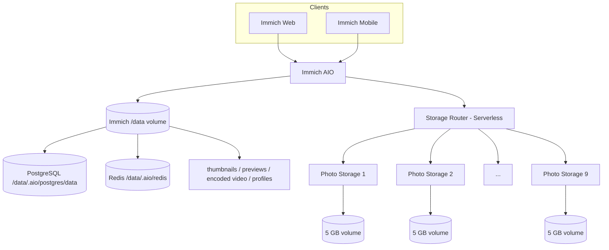

<p align="center"><a href="RAILWAY_REMOTE_STORAGE.md">简体中文</a> · <strong>English</strong></p>

# Railway Multi-Volume Production Architecture

This document describes the current Railway production architecture used by this fork. For normal Immich functionality, see the [official Immich documentation](https://docs.immich.app/).

## Current baseline

As of 2026-09-08:

- Upstream baseline: Immich v3.1.0
- Production branch: `3.1.0-remote`
- Railway project: `Family-Photos`
- Immich: All-in-One with local PostgreSQL 14 + Redis
- Storage Router: Serverless
- Photo Storage: fixed pool of **Photo Storage 1–9**, all Serverless
- Automatic Photo Storage creation: **retired and removed from the repository**

## Production topology



Original photos and videos are distributed across Photo Storage volumes through Storage Router. Immich `/data` remains critical because it now also contains the production PostgreSQL cluster, Redis persistence, and derived media.

## Why Immich AIO is not Serverless

The AIO container runs:

- Immich Server / Microservices
- PostgreSQL 14
- Redis

Putting the whole AIO service to sleep would also suspend the database and background jobs, increasing cold-start and interrupted-job risk. The intended deployment model is therefore:

| Service | Serverless |
|---|---|
| Immich AIO | No, always on |
| Storage Router | Yes |
| Photo Storage 1–9 | Yes |

## Storage Router

The Router exposes one logical HTTP media pool to Immich:

- new files go to the healthy node with the most free space;
- existing files are found by logical path;
- uploads use ephemeral spooling for failover;
- node capacities are aggregated for Immich UI reporting;
- no separate routing database is required.

The active production pool is now defined statically by `STORAGE_NODES`; production code no longer modifies it automatically.

## Capacity reporting

Immich's storage API prefers Router aggregate capacity, so web/mobile clients display the combined remote-media pool instead of only the roughly 5 GB local `/data` filesystem.

Remote capacity reads use a longer timeout and a last-successful-value cache to tolerate Railway Serverless cold starts.

## Thumbnail and remote-original processing

After historical migration, some database paths still point to `/data/...` while the actual original file is stored remotely. The fork currently includes two compatibility layers:

1. file-serving paths can fall back from a missing local `/data/...` file to the same logical path through Storage Router;
2. Sharp/FFmpeg/ExifTool jobs that require a real filesystem path can stage the remote original into ephemeral local storage and remove it after processing.

This allows thumbnail/preview generation without copying the entire remote library back into the Immich volume.

## Fixed Photo Storage pool

Production currently uses Photo Storage 1–9. Each node uses:

- source: `bowardzhang/immich`
- branch: `3.1.0-remote`
- root directory: `/photo-storage`
- volume mount: `/photos_extern`
- healthcheck: `/health`
- Serverless: enabled

`REMOTE_STORAGE_TOKEN` is shared between Router and the Photo Storage nodes.

## Manual capacity expansion

Automatic expansion is retired. If another node is genuinely needed:

1. create `Photo Storage N` manually in Railway;
2. configure the existing repo/branch/root/volume/token pattern;
3. wait for deployment `SUCCESS`;
4. verify `/health`;
5. append the node to Router `STORAGE_NODES`;
6. redeploy Router;
7. verify `/api/storage`, upload, read, delete, and MOVE.

This trades automation for a simpler and more predictable operational model, which is appropriate when expansion is infrequent.

## Retired automatic-provisioning components

These files have been removed:

```text
storage-router/bootstrap.mjs
storage-router/provisioner.mjs
storage-router/maintenance-bootstrap.mjs
```

Old Railway configuration history may still show names such as `STORAGE_PROVISION_*`, `STORAGE_AUTO_PROVISION`, or `RAILWAY_API_TOKEN`. Those variables have been disabled/blanked and are no longer part of the production runtime path.

## One-shot repair cleanup

After the thumbnail repair was completed, the following temporary components were also removed:

```text
all-in-one/audit-thumbnails.mjs
Supervisor thumbnail-audit program
Docker image thumbnail-audit copy step
```

`patch-remote-media-input.mjs` is retained because it provides production media-processing functionality. `patch-web-thumbnail-cache.mjs` is also retained for this branch as a cache-compatibility build patch; it is not a background repair process.

## Production Watch Paths

Storage Router watches only:

```text
/storage-router/server.mjs
/storage-router/serverless-bootstrap.mjs
/storage-router/package.json
/storage-router/Dockerfile
```

README and test changes therefore do not restart the Router.

Photo Storage watches `/photo-storage/**`. Immich AIO watches `all-in-one`, server/web/packages and other files that actually affect its image.

## Data-safety rules

- Do not delete the Immich `/data` volume; it now contains the production PostgreSQL database.
- Do not manually purge `/data/thumbs`, `encoded-video`, `profile`, or similar Immich-managed directories.
- Operate on Photo Storage data through Router/Photo Storage APIs rather than manually moving files behind Immich's back.
- Remote media storage and `/data` complement each other; one does not replace the other.

## Expected Railway service list

Production should now contain only:

```text
Immich
Storage Router
Photo Storage 1
Photo Storage 2
...
Photo Storage 9
```

Separate PostgreSQL, Redis, Machine Learning, temporary AIO validation, and migration-only services are no longer required.

## Upgrading Immich

Continue tracking upstream stable releases with versioned `*-remote` branches:

1. create a new remote branch from the new upstream stable release;
2. port Storage Router, AIO, and remote-media changes;
3. build and run automated tests;
4. validate database migrations in non-production;
5. verify upload/read/delete/MOVE;
6. verify thumbnails, video processing, metadata, and remote staging;
7. verify all nine nodes and Serverless cold-start behavior;
8. switch the production branch only after validation.

Do not point production directly at upstream `main`.

## Related documentation

- [Storage Router](storage-router/README.en.md)
- [Immich AIO](all-in-one/README.en.md)
- [Official Immich documentation](https://docs.immich.app/)
