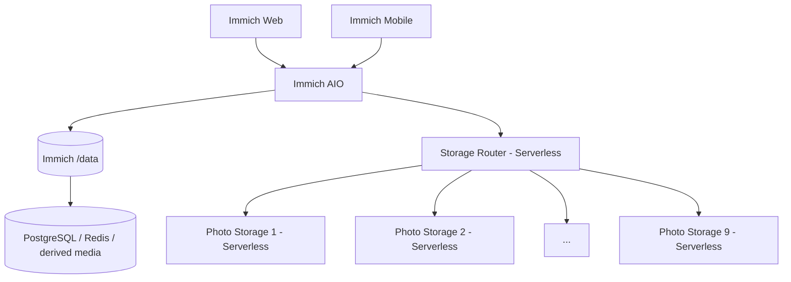

<a href="RAILWAY_REMOTE_STORAGE.md">简体中文</a> · <strong>English</strong>

# Railway Multi-Volume Remote Storage Architecture

This document describes the remote-storage architecture maintained on the `3.2.1-remote` branch.

## Baseline and isolation

- Upstream baseline: Immich v3.2.1
- Upgrade/development branch: `3.2.1-remote`
- Previous stable/rollback branch: `3.1.0-remote`, kept independent
- Storage Router: Serverless
- Photo Storage: fixed pool of **Photo Storage 1-9**, all Serverless
- Automatic Photo Storage provisioning: disabled and must not be restored as part of the v3.2.1 port

The 3.2.1 branch has its own code, CI, Android build and deployment configuration. It must not publish artifacts from `3.1.0-remote` or rewrite the old branch.

## Topology

Original photos and videos are distributed through Storage Router. Immich `/data` remains critical for persistent application state and derived media.

## Deployment model

| Service | Serverless |
|---|---|
| Immich AIO | No, always on |
| Storage Router | Yes |
| Photo Storage 1-9 | Yes |

Storage Router uses the statically configured `STORAGE_NODES` pool. New writes select an eligible healthy node with sufficient free space; uploads can use ephemeral spooling for failover. The router must not create Railway services or volumes automatically.

## Fixed storage pool

The target pool is exactly Photo Storage 1 through Photo Storage 9. For the v3.2.1 deployment, each storage service should use:

- repository: `bowardzhang/immich`
- branch: `3.2.1-remote`
- root directory: `/photo-storage`
- volume mount: `/photos_extern`
- health check: `/health`
- Serverless: enabled

Storage Router should also run from `3.2.1-remote`, avoiding mixed-version Router/storage-node deployments.

## Remote-original compatibility

The v3.2.1 port must preserve remote-original behavior: reads can resolve originals through Storage Router, filesystem-only processing can stage a remote original temporarily, staging files are cleaned after processing, and thumbnails/previews/transcodes remain managed by Immich rather than being treated as original-media pool objects.

## Safety rules

Do not delete or recreate the Immich `/data` volume during the upgrade. Do not clear existing Photo Storage 1-9 volumes. Keep `3.1.0-remote` intact for rollback, subject to database migration compatibility. Do not enable automatic storage provisioning merely because upstream Immich changes.

## v3.2.1 production gate

Before switching production, verify Router/storage syntax and integration tests; health and aggregate capacity for all nine nodes; upload/read/delete/MOVE; existing remote-original reads; thumbnails, previews, metadata and video transcoding; Serverless cold starts; large uploads; the v3.2.1 Android build; and application/database behavior after migration.

Related documents: `RAILWAY_REMOTE_STORAGE.md`, `UPGRADE_ROLLBACK_3.2.1.md`, `ANDROID_RAILWAY.md`, `storage-router/README.md`, and `all-in-one/README.md`.
