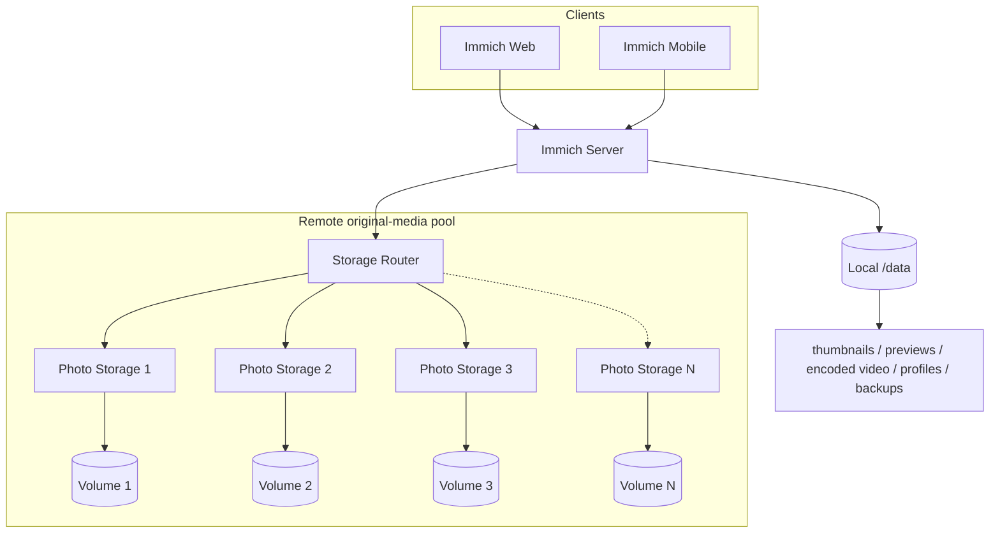
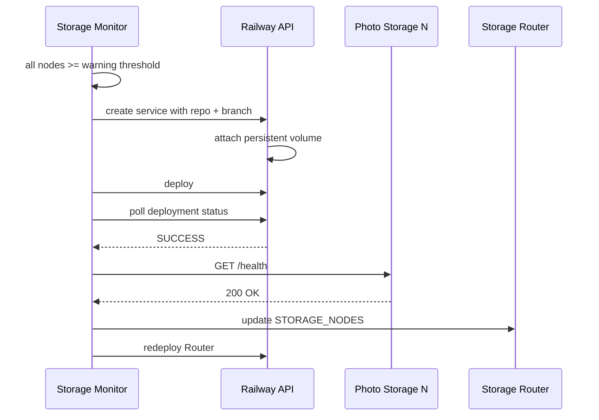
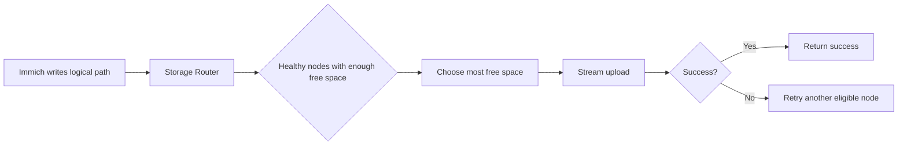
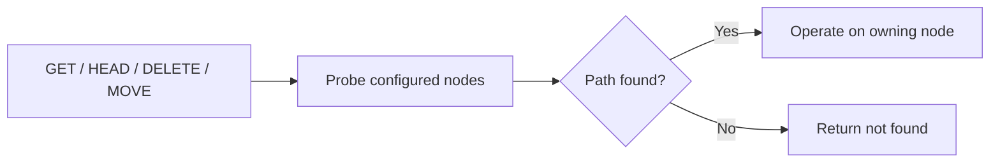
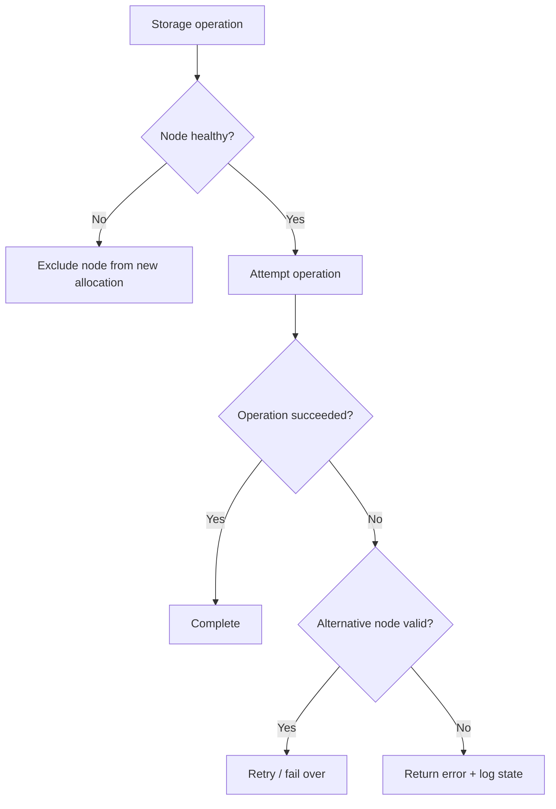
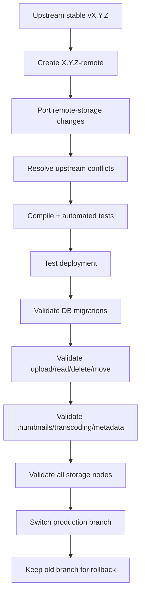

<p align="center"><a href="RAILWAY_REMOTE_STORAGE.md">简体中文</a> · <strong>English</strong></p>

# Railway Multi-Volume Architecture

[](https://github.com/bowardzhang/immich/tree/3.1.0-remote)
[](https://github.com/immich-app/immich/releases/tag/v3.1.0)
[](https://github.com/bowardzhang/immich/actions/workflows/storage-router-test.yml)
[](https://github.com/bowardzhang/immich/commits/3.1.0-remote)

This document describes the downstream architecture added by this repository. For ordinary Immich behavior and user documentation, use the [official Immich documentation](https://docs.immich.app/).

## Design goal

Railway persistent volumes are attached to individual services. This fork turns several one-volume storage services into one logical media pool that Immich can use without exposing physical volume placement to the database or clients.



Original photo/video media is stored through the Storage Router. The Immich `/data` volume remains required for application-managed and derived data; it must not be removed just because original media has moved to remote storage.

## Main fork-specific behavior

### Multi-volume routing

The Storage Router exposes one HTTP API to Immich and manages multiple Photo Storage nodes behind it. New files are allocated to the healthy node with the most free space. Existing files are found by logical path, so no separate routing database is required.

### Aggregate storage reporting

When `REMOTE_STORAGE_URL` is enabled, Immich's storage API reports the combined capacity of the remote storage pool rather than the size of the small local `/data` filesystem. This keeps web/mobile capacity display aligned with the actual media pool.

### Automatic expansion

When every configured storage node is healthy and above the warning threshold, the provisioner can create the next `Photo Storage N`, attach a persistent volume, deploy it, verify health and add it to the router.



The creation request explicitly supplies the configured GitHub repository and branch. The default branch fallback is `3.1.0-remote`.

### Monitoring and alerts

Each Photo Storage node reports actual filesystem capacity. The router logs per-node health, used bytes, free bytes and usage percentage, and can send warning/critical email alerts through Resend.

Default thresholds:

| Setting | Default |
|---|---:|
| Warning | 85% |
| Critical | 95% |
| Capacity check interval | 15 minutes |
| Max storage nodes | 10 |
| Allocation safety margin | 64 MiB |

## Data flow

### Upload



### Existing file access



### Cross-volume move

A same-volume move is handled locally where possible. If a move must cross volumes, the router copies the file first and only deletes the original after the destination write succeeds.

## Service responsibilities

| Component | Responsibility |
|---|---|
| Immich Server | Standard Immich APIs plus remote media integration and aggregate capacity reporting |
| Storage Router | Routing, failover, capacity aggregation, monitoring, alerts, provisioning trigger |
| Photo Storage N | Minimal HTTP file service backed by one persistent volume |
| Railway Provisioner | Creates/configures/deploys the next storage node and updates Router membership |
| `/data` volume | Immich-managed operational and derived data |

## Key configuration

### Immich

```text
IMMICH_MEDIA_LOCATION=/remote/photo-extern
REMOTE_STORAGE_URL=http://storage-router.railway.internal:8080
REMOTE_STORAGE_TOKEN=<shared secret>
```

### Storage Router

The central node list is a JSON array:

```json
[
  {"name":"photo-storage-1","url":"http://photo-storage-1.railway.internal:8080"},
  {"name":"photo-storage-2","url":"http://photo-storage-2.railway.internal:8080"},
  {"name":"photo-storage-3","url":"http://photo-storage-3.railway.internal:8080"}
]
```

Important variables include:

```text
STORAGE_NODES
REMOTE_STORAGE_TOKEN
STORAGE_WARNING_PERCENT
STORAGE_CRITICAL_PERCENT
STORAGE_AUTO_PROVISION
STORAGE_MAX_VOLUMES
RAILWAY_PROJECT_TOKEN or RAILWAY_API_TOKEN
RESEND_API_KEY
ALERT_EMAIL_TO
ALERT_EMAIL_FROM
```

See [`storage-router/README.md`](storage-router/README.md) for the complete reference.

## Cleanup and persistence policy

Temporary data is intentionally kept away from persistent Photo Storage volumes where possible:

- Router upload spooling uses ephemeral `/tmp` and is removed in `finally` cleanup paths.
- Production self-tests use `.storage-router-selftest/` and delete their test files after verification.
- Repository regression tests use in-memory mock volumes.
- Integration test files are placed under dedicated temporary prefixes and use best-effort cleanup.

Do not manually purge Immich-managed thumbnail, encoded-video, profile, backup or related `/data` directories to reclaim space. Those are application-owned assets and should be maintained through Immich-supported workflows.

## Failure handling



Provisioning has separate deployment and health timeouts. A newly created node is not appended to the active Router list until deployment reaches `SUCCESS` and `/health` responds successfully.

## Upgrade model

This fork follows upstream stable releases while isolating custom storage changes in versioned `*-remote` branches.



Do not point production directly at upstream `main`. Railway services tracking a GitHub branch may redeploy automatically when that branch changes, so the production branch switch should be the final controlled step.

## Future work

The main development directions are:

- End-to-end validation of the next automatically provisioned storage node.
- Recovery logic for partially created or misconfigured Railway services.
- Better observability of routing decisions, capacity history and provisioning events.
- Optional alert-recipient discovery from the Immich administrator account.
- Stronger multi-volume regression coverage around media processing workflows.
- Continued adaptation to upstream Immich storage/API changes.

## Current baseline

As of 2026-09-07, this fork is based on upstream **Immich v3.1.0**, using production branch **`3.1.0-remote`**.
