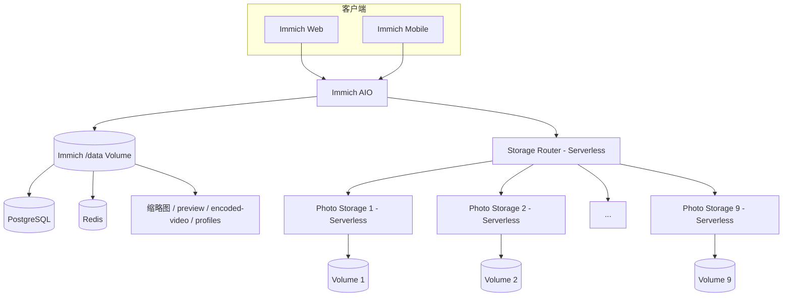

# Railway 多卷远程存储架构

<p align="center"><strong>简体中文</strong> · <a href="RAILWAY_REMOTE_STORAGE.en.md">English</a></p>

本文档描述 `3.2.1-remote` 分支在 Railway 上使用的远程存储架构。标准 Immich 功能请参考 Immich 官方文档。

## 当前基线

- 上游基线：Immich v3.2.1
- 开发/升级分支：`3.2.1-remote`
- 旧稳定分支：`3.1.0-remote`，保持独立，不由本分支覆盖
- 生产项目：`Family-Photos`
- Immich：All-in-One，数据库、Redis 与派生媒体仍使用 Immich `/data`
- Storage Router：Serverless
- Photo Storage：固定 **Photo Storage 1–9** 共 9 个节点，全部 Serverless
- 自动创建 Photo Storage：**保持停用，不恢复自动扩容**

## 拓扑



原始照片和视频通过 Storage Router 分布到固定 Photo Storage 池；Immich `/data` 继续负责数据库、Redis 和派生媒体，因此 `/data` 仍是关键持久化存储。

## 分支隔离

`3.2.1-remote` 以 Immich v3.2.1 为上游基线独立维护 Railway 改动。`3.1.0-remote` 保留为旧版本/回滚基线。

规则：

- 3.2.1 的代码、CI、Android 构建和文档只指向 `3.2.1-remote`；
- 不把 3.2.1 的提交反向写入 `3.1.0-remote`；
- 不复用 3.1.0 Android artifact/release；
- 生产升级通过切换 Railway source branch 完成，而不是改写旧分支；
- 回滚时可以重新指向 `3.1.0-remote`，但数据库迁移兼容性必须按升级/回滚计划确认。

## 为什么 Immich AIO 不使用 Serverless

AIO 内包含长期运行的 Immich 服务以及持久化状态相关组件。让整个 AIO 睡眠会增加数据库、后台任务和冷启动风险。因此设计保持：

| 服务 | Serverless |
|---|---|
| Immich AIO | 否，常驻 |
| Storage Router | 是 |
| Photo Storage 1–9 | 是 |

## Storage Router

Router 向 Immich 暴露一个逻辑 HTTP 存储池：

- 节点池由 `STORAGE_NODES` **静态配置**；
- 新文件选择具有足够容量的健康节点，并优先选择剩余空间较多的节点；
- 已有文件按逻辑路径定位；
- 上传使用 ephemeral spool，以支持目标节点失败后的 failover；
- 聚合所有节点容量供 Immich 使用；
- Serverless 节点允许冷启动，因此 Router 对节点请求具有超时/重试机制。

固定池是架构约束，不应在 3.2.1 升级过程中重新加入自动创建节点的代码。

## 固定 Photo Storage 节点池

目标池固定为：

```text
Photo Storage 1
Photo Storage 2
Photo Storage 3
Photo Storage 4
Photo Storage 5
Photo Storage 6
Photo Storage 7
Photo Storage 8
Photo Storage 9
```

3.2.1 部署时这些服务应使用：

- source：`bowardzhang/immich`
- branch：`3.2.1-remote`
- root directory：`/photo-storage`
- volume mount：`/photos_extern`
- healthcheck：`/health`
- Serverless：开启

`REMOTE_STORAGE_TOKEN` 在 Router 和 Photo Storage 节点之间共享。Storage Router 自身也使用 `3.2.1-remote`，从而避免 Router/节点跨版本运行。

## 手工增加容量

当前架构不自动创建第 10 个或更多 Photo Storage。若未来决定扩展固定池，应作为显式架构变更处理，而不是由 Router 在运行时自行 provision。

在当前 Photo Storage 1–9 范围内更换/新增 Volume 时，应人工完成服务/Volume 配置，等待 deployment 成功，再验证 `/health`、`/api/storage`、上传、读取、删除和 MOVE。

## 远端原图处理

历史数据可能存在数据库逻辑路径与实际远程存储位置之间的兼容需求。升级 3.2.1 时必须继续保证：

1. 原图读取可以通过 Storage Router 找到远程对象；
2. 需要真实文件系统路径的 Sharp/FFmpeg/ExifTool 工作流能够临时 staging 远端原图；
3. staging 文件处理完成后清理；
4. 缩略图、preview、encoded video 等派生数据继续由 Immich 管理，不直接散布到 Photo Storage 池。

## 生产 Watch Paths

Storage Router 应只监视真正影响 Router 镜像的路径，例如 `/storage-router/**`；Photo Storage 只监视 `/photo-storage/**`。文档和测试修改不应无意义地触发生产存储服务重部署。

## 数据安全规则

- 不删除 Immich `/data` Volume；
- 不手工清理 Immich 管理的 thumbnails、encoded-video、profile 等目录；
- Photo Storage Volume 通过 Router/Photo Storage API 管理，避免数据库与文件状态不一致；
- 3.2.1 上线前先验证数据库迁移与回滚边界；
- 不因为升级上游 Immich 而重建或清空 Photo Storage 1–9 的现有 Volume。

## 3.2.1 验证门槛

切换生产到 `3.2.1-remote` 前至少验证：

1. Storage Router 与 Photo Storage 代码语法/集成测试；
2. 9 个节点的 `/health` 与聚合 `/api/storage`；
3. 新照片上传与读取；
4. 大视频上传；
5. 删除和 MOVE；
6. 已有远端原图读取；
7. thumbnail / preview / metadata / video transcode；
8. Serverless 冷启动后的首次读取和写入；
9. Android 3.2.1 客户端构建；
10. 数据库升级后的实际页面和后台任务状态。

只有这些验证通过后，才应把 Railway 的 Immich、Storage Router 和 Photo Storage 1–9 从旧分支切换到 `3.2.1-remote`。

## 相关文档

- `storage-router/README.md` — Router API、固定节点池和手工维护
- `all-in-one/README.md` — Immich AIO 结构
- `UPGRADE_ROLLBACK_3.2.1.md` — 3.2.1 升级与回滚计划
- `ANDROID_RAILWAY.md` — 3.2.1 Railway Android 构建
