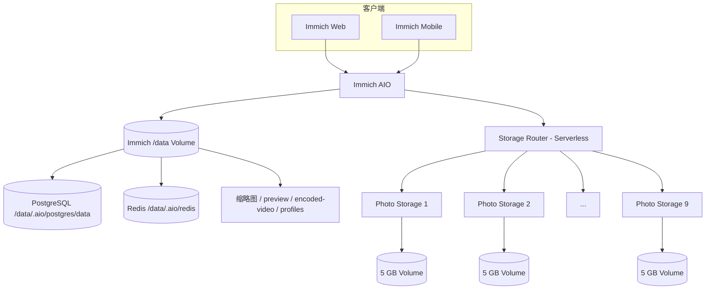

# Railway 多卷远程存储架构

<p align="center"><strong>简体中文</strong> · <a href="RAILWAY_REMOTE_STORAGE.en.md">English</a></p>

本文档描述本仓库在 Railway 上的当前生产架构。标准 Immich 功能请参考 [Immich 官方文档](https://docs.immich.app/)。

## 当前基线

截至 2026-09-08：

- 上游基线：Immich v3.1.0
- 生产分支：`3.1.0-remote`
- 生产项目：`Family-Photos`
- Immich：All-in-One，内置 PostgreSQL 14 + Redis
- Storage Router：Serverless
- Photo Storage：固定 **1–9** 共 9 个节点，全部 Serverless
- 自动创建 Photo Storage：**已停用并从仓库移除**

## 生产拓扑



原始照片和视频通过 Storage Router 分布到 Photo Storage Volume；Immich `/data` 负责本地数据库、Redis 和派生媒体，因此 `/data` 仍是关键生产 Volume。

## 为什么 Immich AIO 不使用 Serverless

Immich AIO 内同时运行：

- Immich Server / Microservices
- PostgreSQL 14
- Redis

如果整个 AIO 睡眠，数据库和后台任务也会一起暂停，会带来冷启动和任务中断风险。因此当前设计是：

| 服务 | Serverless |
|---|---|
| Immich AIO | 否，常驻 |
| Storage Router | 是 |
| Photo Storage 1–9 | 是 |

## Storage Router

Router 向 Immich 暴露一个逻辑 HTTP 存储池：

- 新文件选择剩余空间最多的健康节点；
- 已有文件按逻辑路径定位；
- 上传期间使用 ephemeral spool 支持 failover；
- 聚合所有节点容量供 Immich UI 显示；
- 不维护单独的路由数据库。

当前生产节点由 `STORAGE_NODES` 静态配置，不再由程序自动修改。

## 容量显示

Immich 的 storage API 会优先读取 Router 的聚合容量，因此 Web 页面显示约整个远程媒体池容量，而不是只显示本地 `/data` 的约 5 GB。

远程容量查询具有更长超时和最近成功值缓存，以适应 Serverless 节点冷启动。

## 缩略图和远端原图处理

历史迁移后，一部分数据库路径仍指向 `/data/...`，但实际原图已经位于远程 Photo Storage。当前 Fork 包含两层兼容逻辑：

1. Web/文件读取发现本地 `/data/...` 不存在时，可回退到 Storage Router 同逻辑路径；
2. Sharp/FFmpeg/ExifTool 等需要本地路径时，会把远端原图临时 staging 到 ephemeral 本地文件，处理完成后清理。

因此生成缩略图不需要把整个原图库重新复制回 Immich Volume。

## 固定 Photo Storage 节点池

当前生产使用 Photo Storage 1–9。每个节点：

- source：`bowardzhang/immich`
- branch：`3.1.0-remote`
- root directory：`/photo-storage`
- volume mount：`/photos_extern`
- healthcheck：`/health`
- Serverless：开启

`REMOTE_STORAGE_TOKEN` 在 Router 和节点间共享。

## 手工增加容量

自动扩容已退役。以后如果确实需要新增节点：

1. 手工创建 `Photo Storage N`；
2. 按现有节点配置 source/root/volume/token；
3. 等待 deployment=`SUCCESS`；
4. 验证 `/health`；
5. 把节点加入 Router 的 `STORAGE_NODES`；
6. 重新部署 Router；
7. 验证 `/api/storage`、上传、读取、删除和 MOVE。

这种方式牺牲自动化，但更适合当前低频扩容场景，也避免 Railway API 权限、半创建 service、误挂 Volume 等复杂状态。

## 已退役的自动扩容组件

以下代码已删除：

```text
storage-router/bootstrap.mjs
storage-router/provisioner.mjs
storage-router/maintenance-bootstrap.mjs
```

旧 Railway 环境里仍可能看到名称为 `STORAGE_PROVISION_*`、`STORAGE_AUTO_PROVISION`、`RAILWAY_API_TOKEN` 等历史变量；这些变量已被禁用/清空，当前生产运行路径不再依赖它们。

## 一次性维修代码清理

缩略图修复完成后，以下临时代码也已移除：

```text
all-in-one/audit-thumbnails.mjs
Supervisor thumbnail-audit program
Docker image thumbnail-audit copy step
```

保留的 `patch-remote-media-input.mjs` 属于生产功能；`patch-web-thumbnail-cache.mjs` 用于本分支的缩略图缓存兼容，仍参与 Web build，不属于后台维修任务。

## 生产 Watch Paths

Storage Router 只监视：

```text
/storage-router/server.mjs
/storage-router/serverless-bootstrap.mjs
/storage-router/package.json
/storage-router/Dockerfile
```

因此 README 和测试脚本修改不会触发 Router 重部署。

Photo Storage 只监视 `/photo-storage/**`。Immich AIO 监视 `all-in-one`、server/web/packages 等真正影响镜像的目录。

## 数据安全规则

- 不要删除 Immich `/data` Volume；其中现在包含生产 PostgreSQL。
- 不要手工清理 `/data/thumbs`、`encoded-video`、`profile` 等 Immich 管理目录。
- Photo Storage Volume 只通过 Router/Photo Storage API 操作，避免数据库与文件状态不一致。
- 远程媒体池和 `/data` 是互补关系，不是二选一。

## Railway 服务清单

当前生产只应存在：

```text
Immich
Storage Router
Photo Storage 1
Photo Storage 2
...
Photo Storage 9
```

不再需要独立的 PostgreSQL、Redis、Machine Learning、测试 AIO 或临时迁移服务。

## 升级 Immich

继续使用版本化 `*-remote` 分支跟踪上游 stable：

1. 基于新的上游 stable 创建新 remote 分支；
2. 移植 Storage Router/AIO/远程媒体改动；
3. 编译和测试；
4. 在非生产环境验证数据库迁移；
5. 验证上传、读取、删除、MOVE；
6. 验证缩略图、视频、元数据和远端 staging；
7. 验证 9 节点容量和 Serverless 冷启动；
8. 最后切换 production branch。

不要让生产直接跟踪上游 `main`。

## 相关文档

- [`storage-router/README.md`](storage-router/README.md) — Router API、固定节点池和手工扩容
- [`all-in-one/README.md`](all-in-one/README.md) — Immich AIO 当前结构
- [Immich 官方文档](https://docs.immich.app/)
