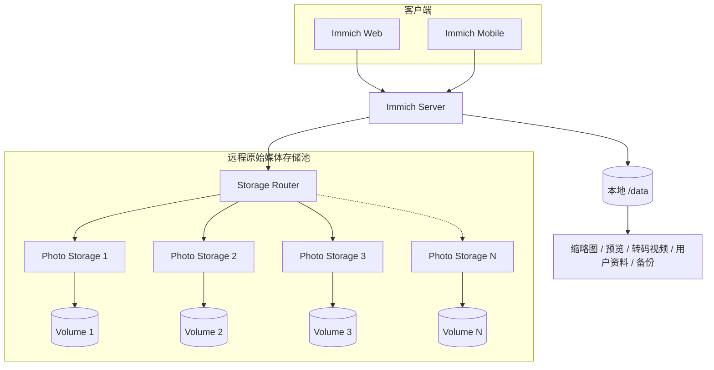
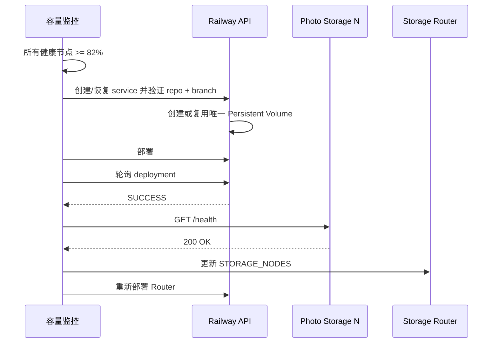
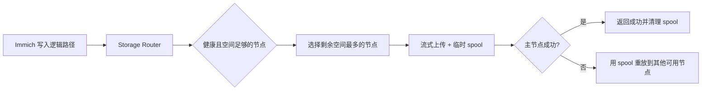
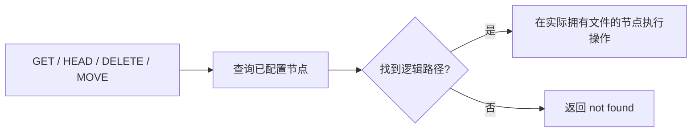
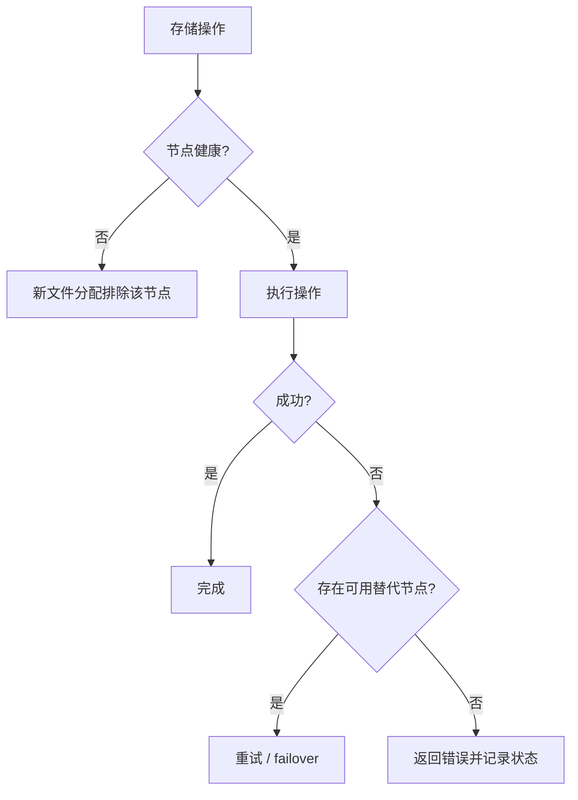
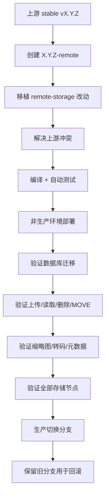

# Railway 多卷远程存储架构

本文档说明本仓库相对于上游 Immich 增加的 Railway 多卷存储架构。标准 Immich 功能和用户操作请参考 [Immich 官方文档](https://docs.immich.app/)。

## 设计目标

Railway Persistent Volume 只能挂载到单个 service。本 Fork 将多个“一服务一卷”的 Photo Storage 服务组合成一个逻辑媒体存储池，使 Immich 无需知道照片实际位于哪个物理 Volume。



原始照片和视频通过 Storage Router 保存。Immich `/data` Volume 仍然用于应用管理的数据和派生文件，因此不能因为原始媒体迁移到了远程存储就删除 `/data`。

## 本 Fork 的核心行为

### 多卷路由

Storage Router 向 Immich 暴露一个 HTTP API，背后管理多个 Photo Storage 节点。新文件优先分配到剩余空间最多的健康节点；已有文件按逻辑路径在节点中定位，因此不需要额外的路由数据库。

### 聚合容量显示

启用 `REMOTE_STORAGE_URL` 后，Immich storage API 返回远程存储池的总容量，而不是小型本地 `/data` 文件系统容量，使 Web/移动客户端显示的容量与实际媒体池一致。

### 自动扩容

自动扩容采用提前触发策略：所有健康节点达到 **82%** 时就开始创建下一 `Photo Storage N`，而不是等到 85% warning 后才开始。85% 和 95% 分别保留为 Warning/Critical 告警阈值。



扩容控制器每 **60 秒**检查一次；如果达到扩容阈值后操作失败，会在 **15 秒**后快速重试。创建请求显式指定 GitHub 仓库和 `3.1.0-remote` 分支，并验证 Railway deployment trigger，防止新节点因为分支缺失而无法部署。

### 监控与告警

每个 Photo Storage 节点报告真实文件系统容量。Router 记录节点健康状态、已用空间、剩余空间和使用率，并可通过 Resend 发送容量告警。

| 设置 | 当前默认值 |
|---|---:|
| 提前扩容 | 82% |
| Warning | 85% |
| Critical | 95% |
| 容量检查间隔 | 60 秒 |
| 扩容检查间隔 | 60 秒 |
| 扩容失败重试 | 15 秒 |
| 最大存储节点 | 10 |
| 分配安全余量 | 64 MiB |

## 数据流

### 上传



Router 一边把请求流向选定 Photo Storage，一边把同一数据临时 spool 到 ephemeral `/tmp`。正常成功路径不需要再进行第二次完整复制；主节点失败时才使用 spool 进行 failover。客户端中止上传时会清理未完成的临时文件。

### 已有文件访问



### 跨 Volume MOVE

同一节点内尽量使用本地 MOVE。必须跨 Volume 时，Router 先复制到目标节点，只有目标写入成功后才删除源文件，从而避免 MOVE 失败造成源数据丢失。

## 服务职责

| 组件 | 职责 |
|---|---|
| Immich Server | 标准 Immich API、远程媒体集成、聚合容量显示 |
| Storage Router | 路由、故障转移、容量聚合、监控、告警、扩容触发 |
| Photo Storage N | 一个 Persistent Volume 对应的最小 HTTP 文件服务 |
| Railway Provisioner | 创建/恢复/部署下一存储节点并更新 Router 成员 |
| `/data` Volume | Immich 自己管理的运行数据和派生媒体 |

## 关键配置

### Immich

```text
IMMICH_MEDIA_LOCATION=/remote/photo-extern
REMOTE_STORAGE_URL=http://storage-router.railway.internal:8080
REMOTE_STORAGE_TOKEN=<共享密钥>
```

### Storage Router

`STORAGE_NODES` 是 Photo Storage 节点的 JSON 数组，例如：

```json
[
  {"name":"photo-storage-1","url":"http://photo-storage-1.railway.internal:8080"},
  {"name":"photo-storage-2","url":"http://photo-storage-2.railway.internal:8080"},
  {"name":"photo-storage-3","url":"http://photo-storage-3.railway.internal:8080"}
]
```

重要变量：

```text
STORAGE_NODES
REMOTE_STORAGE_TOKEN
STORAGE_PROVISION_TRIGGER_PERCENT
STORAGE_WARNING_PERCENT
STORAGE_CRITICAL_PERCENT
STORAGE_AUTO_PROVISION
STORAGE_MAX_VOLUMES
STORAGE_CHECK_INTERVAL_MS
STORAGE_PROVISION_CHECK_INTERVAL_MS
STORAGE_PROVISION_RETRY_INTERVAL_MS
RAILWAY_PROJECT_TOKEN 或 RAILWAY_API_TOKEN
RESEND_API_KEY
ALERT_EMAIL_TO
ALERT_EMAIL_FROM
```

完整说明见 [`storage-router/README.md`](storage-router/README.md)。

## 自动扩容恢复策略

Provisioner 不仅处理“全新创建”，也处理上一次扩容中断后留下的部分资源：

1. 计算下一节点名称 `Photo Storage N`。
2. 如果 service 已存在则复用，不重复创建。
3. 显式验证 GitHub repo 和 branch deployment trigger。
4. 如果已有一个 Persistent Volume，则复用该 Volume；不会错误地再挂第二个 Volume。
5. 配置 `/photo-storage`、环境变量和 `/photos_extern` 挂载点。
6. 发起 deployment 并轮询到终态。
7. 只有 deployment 为 `SUCCESS` 且 `/health` 成功后，才把节点加入 `STORAGE_NODES`。
8. 更新 Router 配置并重新部署 Router。
9. 如果中途发生可恢复错误，在达到容量触发条件时 15 秒后重试。

这种设计避免“service 已经创建，但 branch/volume/deployment 只完成一半”后永久卡住。

## 临时文件与持久化策略

- Router upload spool 使用 ephemeral `/tmp`，完成或失败后清理。
- 生产 self-test 使用 `.storage-router-selftest/`，验证后删除测试文件。
- 仓库回归测试使用内存 mock volume。
- 集成测试使用独立临时前缀，并在 `finally` 中尽力清理。

不要为了释放空间手工删除 Immich 管理的 `thumbs`、`encoded-video`、`profile`、`backups` 等 `/data` 目录。这些属于应用数据，应通过 Immich 支持的方式维护。

## 故障处理



新创建的节点在 deployment 达到 `SUCCESS` 且 `/health` 返回成功之前，不会加入活动 Router 节点列表。

## Railway Watch Paths

为避免文档、测试或移动端改动导致正在备份照片时无意义地重启生产服务，生产服务使用 Watch Paths。例如 Storage Router 只监视真正进入生产镜像的核心文件；测试和 README 改动不会触发 Router 重部署。

因此更新中文文档不会中断当前照片备份。

## 升级模型

本 Fork 使用版本化 `*-remote` 分支跟踪上游 stable release：



不要让生产环境直接跟踪上游 `main`。生产 branch switch 应是完成兼容性验证后的最后一步。

## 当前基线

截至 2026-09-08，本 Fork 基于上游 **Immich v3.1.0**，生产分支为 **`3.1.0-remote`**。

## 相关文档

- [`README.md`](README.md) — 项目总体架构和快速说明
- [`storage-router/README.md`](storage-router/README.md) — Storage Router 配置、API、监控和自动扩容详细说明
- [Immich 官方文档](https://docs.immich.app/) — 上游标准功能文档
