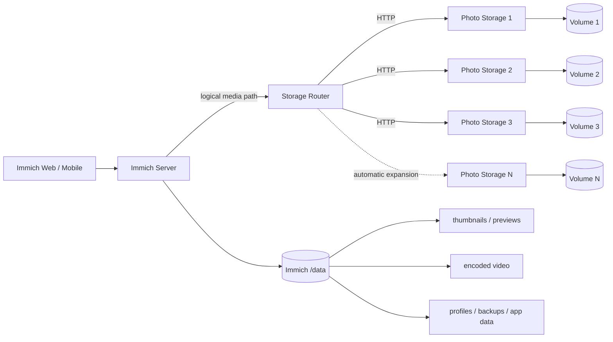

# Immich Railway Multi-Volume Storage Fork

<p align="center">
  <a href="README.md">简体中文</a> · <strong>English</strong>
</p>

This repository is a downstream fork of [immich-app/immich](https://github.com/immich-app/immich), customized for Railway with HTTP-backed multi-volume media storage, automatic expansion, aggregate capacity reporting, health monitoring, and capacity alerts.

> [!IMPORTANT]
> Standard Immich features and user documentation remain upstream. This fork primarily adds the Railway storage architecture described below.

## What is different from upstream?

| Feature | Upstream Immich | This fork |
|---|---|---|
| Photo/video management | Full Immich feature set | Preserved |
| Original media storage | Local/filesystem | **HTTP multi-volume pool** |
| Multiple Railway volumes | Manual integration | **Storage Router + Photo Storage nodes** |
| Capacity shown in Immich | Local storage | **Aggregate remote pool capacity** |
| New-file placement | N/A | **Healthiest node with the most free space** |
| Upload failover | N/A | **Retry another eligible node** |
| Storage monitoring | External | **Per-volume health and usage** |
| Capacity alerts | External | **Resend email alerts** |
| Expansion | Manual | **Automatic `Photo Storage N` provisioning** |
| Default max nodes | Deployment-dependent | **10** |

## Architecture



Original photo/video media is stored through Storage Router. Immich's own `/data` volume remains required for application-managed and derived data.

## Automatic expansion

All healthy storage nodes reaching **82%** triggers proactive provisioning of the next storage node. **85%** remains the warning threshold and **95%** the critical threshold. Expansion checks run every **60 seconds**; after a provisioning failure, retry happens after **15 seconds**.

Key defaults:

- Provision trigger: `82%`
- Warning: `85%`
- Critical: `95%`
- Expansion check: `60 seconds`
- Provision retry: `15 seconds`
- Max storage nodes: `10`
- Production branch fallback: `3.1.0-remote`
- Photo Storage root directory: `/photo-storage`
- Volume mount path: `/photos_extern`

## Components

```text
immich/
├── server/
├── storage-router/
│   ├── server.mjs
│   ├── bootstrap.mjs
│   ├── provisioner.mjs
│   ├── selftest.mjs
│   ├── README.md
│   └── README.en.md
├── photo-storage/
├── .github/workflows/storage-router-test.yml
├── RAILWAY_REMOTE_STORAGE.md
└── RAILWAY_REMOTE_STORAGE.en.md
```

## Configuration overview

### Immich Server

```text
IMMICH_MEDIA_LOCATION=/remote/photo-extern
REMOTE_STORAGE_URL=http://storage-router.railway.internal:8080
REMOTE_STORAGE_TOKEN=<shared secret>
```

### Storage Router

Important variables include:

```text
STORAGE_NODES
REMOTE_STORAGE_TOKEN
STORAGE_PROVISION_TRIGGER_PERCENT
STORAGE_WARNING_PERCENT
STORAGE_CRITICAL_PERCENT
STORAGE_AUTO_PROVISION
STORAGE_MAX_VOLUMES
RAILWAY_PROJECT_TOKEN or RAILWAY_API_TOKEN
RESEND_API_KEY
ALERT_EMAIL_TO
ALERT_EMAIL_FROM
```

See [Storage Router documentation](storage-router/README.en.md) for the complete reference.

## Reliability and data safety

Uploads are streamed to the selected Photo Storage node while being spooled to ephemeral local storage so the router can replay the request to another eligible node if the primary upload fails. Client-aborted uploads clean up the temporary spool.

Cross-volume MOVE copies first and deletes the source only after the destination write succeeds. The router also uses a 64 MiB allocation safety margin, real `statfs` capacity, health checks, deployment polling, and lifecycle self-tests.

> [!WARNING]
> The multi-volume architecture is **not a backup strategy**. Keep independent backups of important photos and videos.

## Upgrade strategy

This fork tracks upstream **stable releases** using versioned `*-remote` branches rather than deploying upstream `main` directly. Validate database migrations, upload/read/delete/MOVE, thumbnails, transcoding, metadata extraction, aggregate capacity, and multi-volume routing before switching production.

Current production baseline: **Immich v3.1.0**, branch **`3.1.0-remote`**.

## Documentation

- [中文 README（默认）](README.md)
- [Railway remote storage — English](RAILWAY_REMOTE_STORAGE.en.md)
- [Storage Router — English](storage-router/README.en.md)
- [Official Immich documentation](https://docs.immich.app/)
