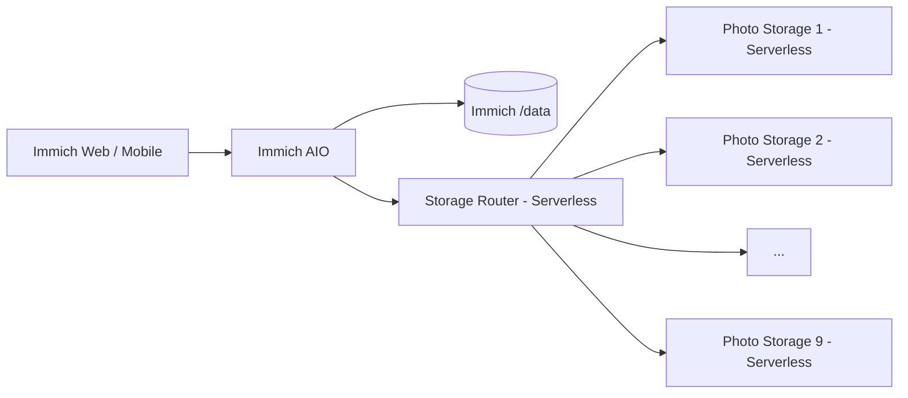

# Immich Railway Multi-Volume Storage Fork

<p align="center"><a href="README.md">简体中文</a> · <strong>English</strong></p>

This repository is a downstream fork of [immich-app/immich](https://github.com/immich-app/immich), customized for Railway with HTTP-backed multi-volume media storage, aggregate capacity reporting, remote-media compatibility, and an All-in-One deployment.

> [!IMPORTANT]
> Production has moved from automatic expansion to a **fixed pool of nine Photo Storage nodes**. The code that automatically created Railway services/volumes has been removed; future expansion is manual.

## Current production architecture



Immich AIO runs Immich, PostgreSQL 14, and Redis in one service, so it remains always-on. Storage Router and Photo Storage 1–9 run in Railway Serverless mode.

## Main differences from upstream

| Feature | Upstream Immich | This fork |
|---|---|---|
| Standard photo/video features | ✅ | ✅ Preserved |
| Original media storage | Local filesystem | **HTTP multi-volume pool** |
| Multiple Railway volumes | Custom integration required | **Storage Router + Photo Storage 1–9** |
| Capacity shown in Immich | Local filesystem capacity | **Aggregate remote-pool capacity** |
| New-file placement | N/A | **Healthy node with the most free space** |
| Upload failover | N/A | **Temporary spool + failover** |
| Media processing | Local filesystem paths | **Remote-original staging supported** |
| Database/Redis | Commonly separate services | **Embedded PostgreSQL + Redis in AIO** |
| Expansion | Deployment-specific | **Manual in current production** |

## Current fork-specific components

```text
immich/
├── all-in-one/
│   ├── Dockerfile
│   ├── entrypoint.sh
│   ├── supervisord.conf
│   ├── patch-remote-media-input.mjs
│   └── patch-web-thumbnail-cache.mjs
├── storage-router/
│   ├── server.mjs
│   ├── serverless-bootstrap.mjs
│   ├── selftest.mjs
│   └── test-multi-volume.mjs
├── photo-storage/
│   └── server.mjs
├── RAILWAY_REMOTE_STORAGE.en.md
└── README.md
```

Retired historical components:

```text
storage-router/bootstrap.mjs
storage-router/provisioner.mjs
storage-router/maintenance-bootstrap.mjs
all-in-one/audit-thumbnails.mjs
```

## Storage behavior

For new uploads, Router queries real free space across the fixed node pool and chooses the healthy node with the most available capacity. It streams to that node while keeping an ephemeral `/tmp` spool; the spool is replayed only when the primary upload fails.

Existing files do not require a separate routing database. Router probes Photo Storage 1–9 by logical path and routes GET/HEAD/DELETE/MOVE to the node that actually owns the file.

## Aggregate capacity

Immich's storage API reads aggregate capacity from Storage Router, so web/mobile clients display the logical Photo Storage pool instead of only the roughly 5 GB local `/data` volume.

## Thumbnails and remote media

This fork supports:

- fallback to Storage Router when a historical `/data/...` file no longer exists locally;
- temporary staging of remote originals for Sharp/FFmpeg/ExifTool jobs that require a local path;
- cleanup of staged files after processing;
- a fixed thumbnail cache version in the web build to avoid reusing historical failed thumbnail responses.

## Expected Railway production services

Production should contain only:

```text
Immich
Storage Router
Photo Storage 1
Photo Storage 2
...
Photo Storage 9
```

Separate PostgreSQL, Redis, Machine Learning, temporary AIO validation, and migration-only services are no longer required.

## Manual expansion

If additional capacity is needed, create `Photo Storage N` manually, mount one volume at `/photos_extern`, configure the same token, then add the node to Router `STORAGE_NODES`. See the [Storage Router documentation](storage-router/README.en.md) for the exact procedure.

## Data safety

> [!WARNING]
> This multi-volume architecture is not a backup strategy. Keep independent backups of important media.

Do not delete the production Immich `/data` volume. It now contains the production PostgreSQL database, Redis persistence, and Immich-derived media.

## Upgrade strategy

Continue tracking upstream stable releases with versioned `*-remote` branches. Do not point production directly at upstream `main`. Before switching production, validate database migrations, upload/read/delete/MOVE, thumbnails, video processing, remote staging, aggregate capacity, and all storage nodes.

Current production baseline: **Immich v3.1.0 / `3.1.0-remote`**.

## Documentation

- [Railway production architecture and operations](RAILWAY_REMOTE_STORAGE.en.md)
- [Storage Router](storage-router/README.en.md)
- [Immich AIO](all-in-one/README.en.md)
- [Official Immich documentation](https://docs.immich.app/)

This repository continues to follow the upstream **AGPL-3.0** license.
