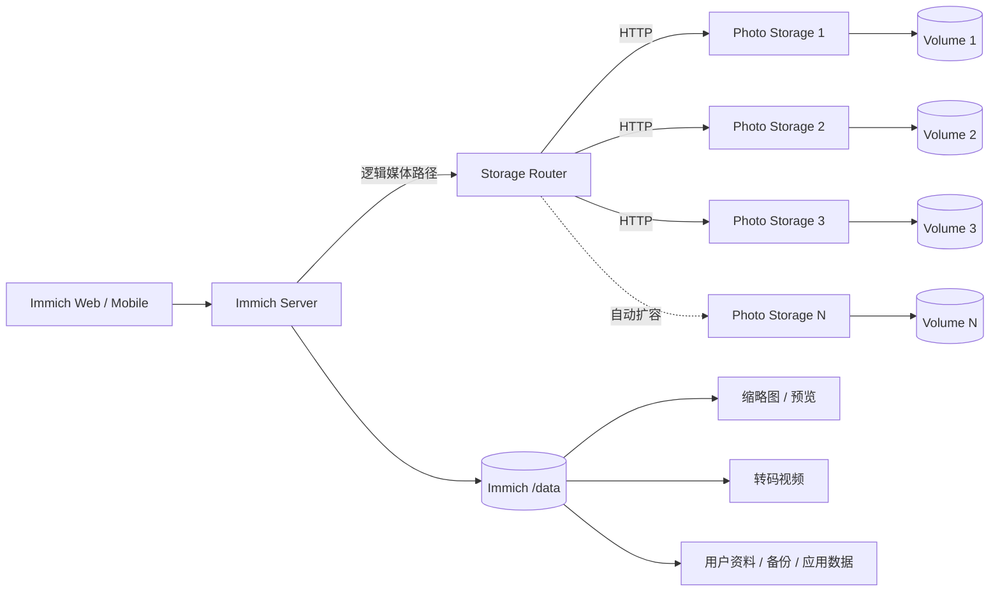
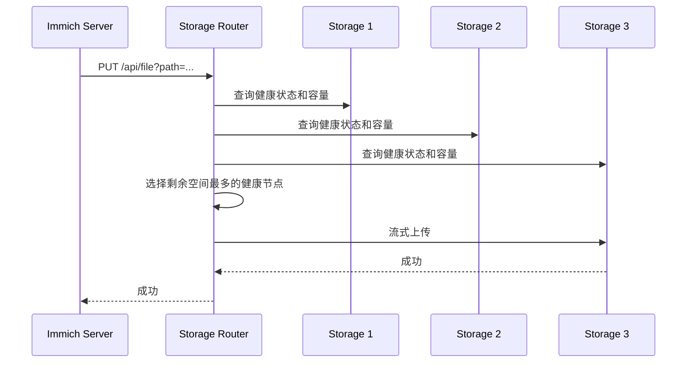
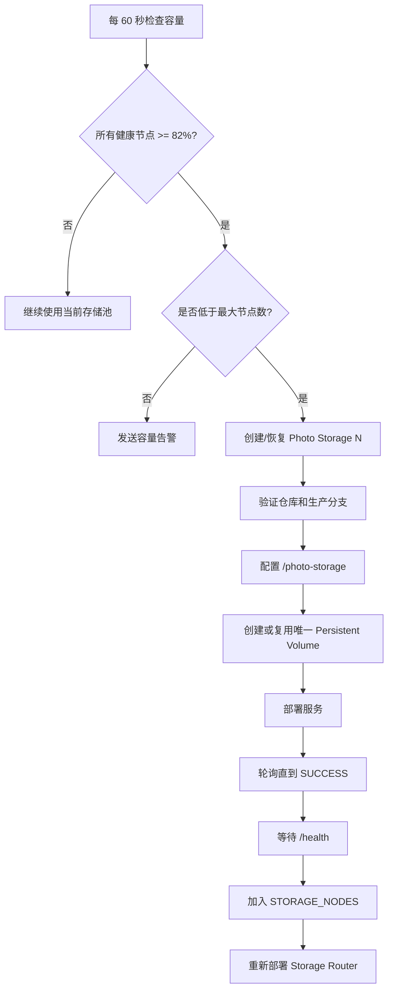

# Immich Railway 多卷存储 Fork

<p align="center"><strong>简体中文</strong> · <a href="README.en.md">English</a></p>

<p align="center">
  <a href="https://github.com/bowardzhang/immich/actions/workflows/storage-router-test.yml"></a>
  <a href="https://github.com/bowardzhang/immich/tree/3.1.0-remote"></a>
  <a href="https://github.com/immich-app/immich/releases/tag/v3.1.0"></a>
  <a href="https://github.com/bowardzhang/immich/commits/3.1.0-remote"></a>
  <a href="https://opensource.org/license/agpl-v3"></a>
</p>

<p align="center">
  
</p>

<p align="center"><strong>针对 Railway 改造的 Immich：支持基于 HTTP 的多卷媒体存储、自动扩容、聚合容量显示、健康监控和容量告警。</strong></p>

> [!IMPORTANT]
> 本仓库是 **[immich-app/immich](https://github.com/immich-app/immich) 的下游 Fork**。上游项目提供完整的照片/视频管理应用；本 Fork 主要增加面向 Railway 的可扩展多卷存储架构，同时尽量保持 Immich Web 和移动客户端的原有使用体验。

## 本 Fork 与上游有什么不同？

原版 Immich 假设媒体库位于本地文件系统。本 Fork 增加 HTTP 存储层，让原始照片和视频可以分布在多个 Railway Persistent Volume 上，而对 Immich 暴露为一个逻辑存储池。

| 功能 | 上游 Immich | 本 Fork |
|---|---|---|
| 照片/视频管理 | ✅ 完整 Immich 功能 | ✅ 保留 |
| 原始媒体存储 | 本地/文件系统 | **HTTP 多卷存储池** |
| 多个 Railway Volume | 需自行集成 | **Storage Router + Photo Storage 节点** |
| Immich 容量显示 | 本地存储容量 | **远程存储池聚合容量** |
| 新文件分配 | 不适用 | **选择剩余空间最多的健康节点** |
| 上传故障转移 | 不适用 | **失败后尝试其他可用节点** |
| 存储监控 | 外部实现 | **逐卷健康状态和使用率** |
| 容量告警 | 外部实现 | **Resend 邮件告警** |
| 扩容 | 手动 | **自动创建 `Photo Storage N`** |
| 默认最大节点数 | 取决于部署 | **10 个** |

## 架构



核心原则：**原始照片和视频通过 Storage Router 存储**；Immich 自己的 `/data` Volume 继续保存应用管理的数据和派生文件。迁移原始媒体后也不要删除 `/data`。

## 文件如何写入



已有文件不依赖单独的路由数据库。Router 根据逻辑路径查询各节点，并把后续读取、移动和删除操作路由到实际保存该文件的节点。

## 自动扩容

自动扩容采用“提前扩容”而不是等到 Volume 已经接近写满。当前默认所有健康节点达到 **82%** 时开始创建下一存储节点；**85%** 是正常容量告警线，**95%** 是严重告警线。扩容检查每 **60 秒**执行一次，达到触发条件后若扩容失败则 **15 秒**后重试。



当前主要默认值：

- 提前扩容阈值：`82%`
- Warning：`85%`
- Critical：`95%`
- 扩容检查：`60 秒`
- 扩容失败重试：`15 秒`
- 最大存储节点：`10`
- 生产分支 fallback：`3.1.0-remote`
- Storage service 根目录：`/photo-storage`
- Volume 挂载点：`/photos_extern`

Provisioner 创建新节点时会显式指定 GitHub 仓库、环境和分支，并验证 Railway deployment trigger；恢复已有节点时会复用已经挂载的唯一 Volume，避免错误地为同一 service 再挂第二个 Volume。

## 主要组件

```text
immich/
├── server/                       # Immich Server 的远程媒体访问改造
├── storage-router/
│   ├── server.mjs               # 路由、容量、文件 API、告警
│   ├── bootstrap.mjs            # 启动、监控、自动扩容入口
│   ├── provisioner.mjs          # Railway 自动扩容
│   ├── selftest.mjs             # 生产安全的生命周期自检
│   └── README.md                # Storage Router 中文详细文档
├── photo-storage/
│   ├── server.mjs               # 单 Volume HTTP 存储服务
│   └── Dockerfile
├── .github/workflows/
│   └── storage-router-test.yml  # 多卷回归测试 CI
└── RAILWAY_REMOTE_STORAGE.md    # Railway 部署、运维与升级文档
```

## 配置概览

### Immich Server

| 变量 | 用途 |
|---|---|
| `IMMICH_MEDIA_LOCATION` | 逻辑媒体路径，通常为 `/remote/photo-extern` |
| `REMOTE_STORAGE_URL` | Storage Router Railway 私网地址 |
| `REMOTE_STORAGE_TOKEN` | 共享认证 Token |

### Storage Router

| 变量 | 用途 |
|---|---|
| `STORAGE_NODES` | Photo Storage 私网 endpoint 的 JSON 列表 |
| `REMOTE_STORAGE_TOKEN` | Router 与 Photo Storage API 认证 |
| `STORAGE_PROVISION_TRIGGER_PERCENT` | 提前扩容阈值，默认 82 |
| `STORAGE_WARNING_PERCENT` | Warning 阈值，默认 85 |
| `STORAGE_CRITICAL_PERCENT` | Critical 阈值，默认 95 |
| `STORAGE_AUTO_PROVISION` | 是否启用自动扩容 |
| `RAILWAY_PROJECT_TOKEN` / `RAILWAY_API_TOKEN` | 自动扩容使用的 Railway 项目权限 |
| `RESEND_API_KEY` | 可选邮件告警 |
| `ALERT_EMAIL_TO` | 告警收件人 |
| `ALERT_EMAIL_FROM` | 告警发件人 |

完整变量、API 和扩容行为请参阅 **[Storage Router 中文详细文档](storage-router/README.md)**。

## Storage Router API

```text
GET    /health
GET    /api/storage
GET    /api/storage/status
GET    /api/file?path=...
HEAD   /api/file?path=...
PUT    /api/file?path=...
DELETE /api/file?path=...
MOVE   /api/file?path=...&source=...
GET    /api/list?path=...&recursive=true|false
```

`/api/storage` 返回整个远程存储池的聚合容量，因此 Immich Web/移动端看到的是所有 Photo Storage Volume 的总容量，而不是仅看到本地 `/data`。

## 可靠性与数据安全

上传采用流式路径。Router 在向选定 Photo Storage 写入的同时进行临时 spool，以便主节点失败时把已经接收的数据重放到其他符合条件的节点。客户端中止上传时会清理临时 spool，避免 `/tmp` 残留。

跨 Volume MOVE 会先复制到目标节点，只有目标写入成功后才删除源文件。Router 还使用 64 MiB 的分配安全余量、真实 `statfs` 文件系统容量、健康检查、部署轮询以及 self-test 文件清理。

> [!WARNING]
> 这套多卷存储架构**不是备份方案**。重要照片和视频仍应保留独立备份，建议遵循 3-2-1 备份原则。

## 上游 Immich

Immich 是高性能、自托管的照片和视频管理平台，支持移动端自动备份、相册、搜索、人脸识别、地图、分享、RAW 等功能。本 Fork 不复制上游全部用户手册；标准 Immich 功能请使用官方资料：

- [Immich 官方文档](https://docs.immich.app/)
- [Immich 上游项目](https://github.com/immich-app/immich)
- [Immich Releases](https://github.com/immich-app/immich/releases)

## 升级策略

本仓库跟踪上游 **stable release**，而不是直接部署上游 `main`。


当前生产基线为 `Immich v3.1.0`，生产分支为 `3.1.0-remote`。详细部署、运维和升级流程见 **[Railway 远程存储中文文档](RAILWAY_REMOTE_STORAGE.md)**。

## 后续开发方向

- 持续验证自动创建下一 `Photo Storage N` 的完整生命周期。
- 加强 Railway service 部分创建/配置失败后的自动恢复。
- 改善路由决策、节点健康、容量历史和扩容事件的可观测性。
- 扩展上传、下载、移动、删除、转码和元数据处理的多卷回归测试。
- 随上游 Immich stable release 持续适配存储/API 改动。
- 对超大文件进一步研究可恢复/分块上传，减少 Railway 单请求时限造成的失败。

## 文档

本 Fork 自己维护的核心文档均提供中文：

- **[本 README：项目概览与架构](README.md)**
- **[Railway 远程存储：部署、运维与升级](RAILWAY_REMOTE_STORAGE.md)**
- **[Storage Router：配置、API、监控和自动扩容](storage-router/README.md)**
- [Immich 官方文档](https://docs.immich.app/) — 上游标准 Immich 功能文档

## 许可证与署名

本仓库继续遵循上游项目的 **GNU Affero General Public License v3.0（AGPL-3.0）**。应用主体来自优秀的 [Immich](https://github.com/immich-app/immich) 项目；Railway 多卷存储架构及相关集成为本 Fork 的下游改动。
