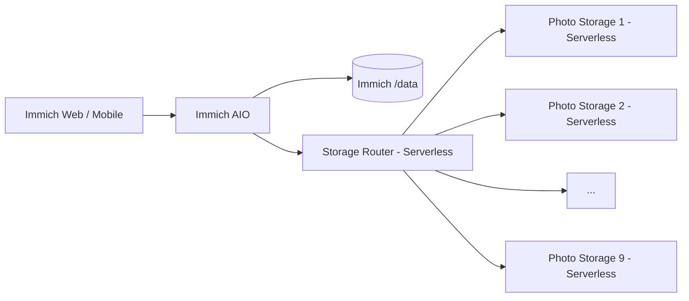

# Immich Railway 多卷存储 Fork

<p align="center"><strong>简体中文</strong> · <a href="README.en.md">English</a></p>

本仓库是 [immich-app/immich](https://github.com/immich-app/immich) 的下游 Fork，面向 Railway 增加多卷 HTTP 媒体存储、聚合容量、远程媒体兼容和 All-in-One 部署。

> [!IMPORTANT]
> 当前生产环境已经从“自动扩容”模式切换为**固定 9 个 Photo Storage 节点**。自动创建 Railway service/volume 的 provisioner 已删除，后续扩容改为手工操作。

## 当前生产架构



Immich AIO 中同时运行 Immich、PostgreSQL 14 和 Redis，因此保持常驻；Storage Router 和 Photo Storage 1–9 均启用 Railway Serverless。

## 与上游的主要区别

| 功能 | 上游 Immich | 本 Fork |
|---|---|---|
| 标准照片/视频管理 | ✅ | ✅ 保留 |
| 原始媒体存储 | 本地文件系统 | **HTTP 多卷存储池** |
| 多个 Railway Volume | 需自行集成 | **Storage Router + Photo Storage 1–9** |
| 容量显示 | 本地文件系统容量 | **远程存储池聚合容量** |
| 新文件分配 | 不适用 | **剩余空间最多的健康节点** |
| 上传故障转移 | 不适用 | **临时 spool + failover** |
| 媒体处理 | 本地路径 | **支持远程原图临时 staging** |
| 数据库/Redis | 通常独立服务 | **AIO 内置 PostgreSQL + Redis** |
| 扩容 | 取决于部署 | **当前手工扩容** |

## 当前关键组件

```text
immich/
├── all-in-one/
│   ├── Dockerfile
│   ├── entrypoint.sh
│   ├── supervisord.conf
│   ├── patch-remote-media-input.mjs
│   └── patch-web-thumbnail-cache.mjs
├── storage-router/
│   ├── server.mjs
│   ├── serverless-bootstrap.mjs
│   ├── selftest.mjs
│   └── test-multi-volume.mjs
├── photo-storage/
│   └── server.mjs
├── RAILWAY_REMOTE_STORAGE.md
└── README.en.md
```

以下历史组件已经删除：

```text
storage-router/bootstrap.mjs
storage-router/provisioner.mjs
storage-router/maintenance-bootstrap.mjs
all-in-one/audit-thumbnails.mjs
```

## 存储工作方式

新上传文件由 Router 查询所有固定节点的真实剩余空间，选择可用空间最多的健康节点。上传时一边向目标节点流式写入，一边在 ephemeral `/tmp` 保存临时 spool；只有主节点失败时才用 spool 向其他节点重放。

已有文件不依赖单独的路由数据库。Router 根据逻辑路径查询 Photo Storage 1–9，并把 GET/HEAD/DELETE/MOVE 路由到实际保存该文件的节点。

## 聚合容量

Immich storage API 会读取 Storage Router 的聚合容量，因此 Web/移动端显示整个 Photo Storage 池，而不是只显示本地 `/data` 的约 5 GB。

## 缩略图和远程媒体

本 Fork 支持：

- `/data/...` 本地文件不存在时回退到远程 Storage Router；
- Sharp/FFmpeg/ExifTool 需要本地路径时，临时取回远程原图；
- 处理完成后清理临时 staging 文件；
- Web build 中使用固定缩略图缓存版本，避免历史失败响应继续被浏览器缓存。

## Railway 生产服务

当前 production 只应存在：

```text
Immich
Storage Router
Photo Storage 1
Photo Storage 2
...
Photo Storage 9
```

独立 PostgreSQL、Redis、Machine Learning、测试 AIO 和迁移临时服务均不再需要。

## 手工扩容

以后如果容量不够，需要手工创建 `Photo Storage N`，挂载一个 Volume 到 `/photos_extern`，配置相同 token，并把节点加入 Router 的 `STORAGE_NODES`。详细步骤见 [Storage Router 中文文档](storage-router/README.md)。

## 数据安全

> [!WARNING]
> 多卷架构不是备份方案。重要照片和视频仍应保留独立备份。

不要删除生产 `Immich /data` Volume，因为其中现在包含生产 PostgreSQL 数据库、Redis 和 Immich 派生媒体。

## 升级策略

继续用版本化 `*-remote` 分支跟踪上游 stable release，不要让生产环境直接跟踪上游 `main`。升级前至少验证数据库迁移、上传/读取/删除/MOVE、缩略图、视频处理、远程 staging、聚合容量和全部存储节点。

当前生产基线：**Immich v3.1.0 / `3.1.0-remote`**。

## 文档

- [Railway 当前生产架构与运维](RAILWAY_REMOTE_STORAGE.md)
- [Storage Router 中文文档](storage-router/README.md)
- [Immich AIO 中文文档](all-in-one/README.md)
- [Immich 官方文档](https://docs.immich.app/)

本仓库继续遵循上游 **AGPL-3.0** 许可证。
