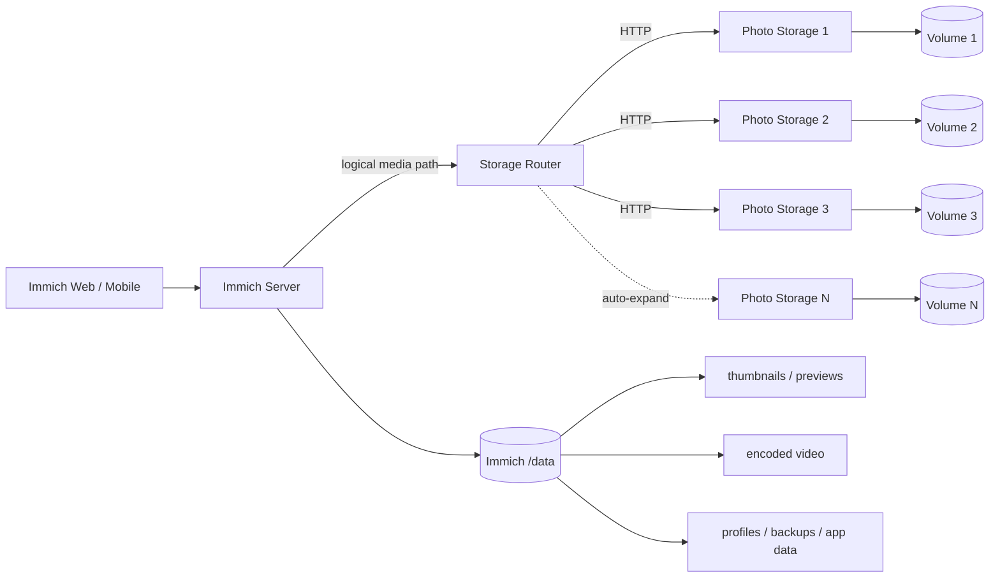
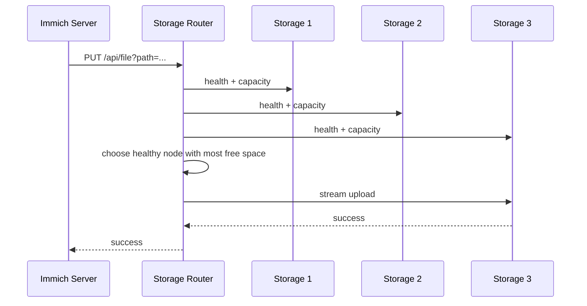
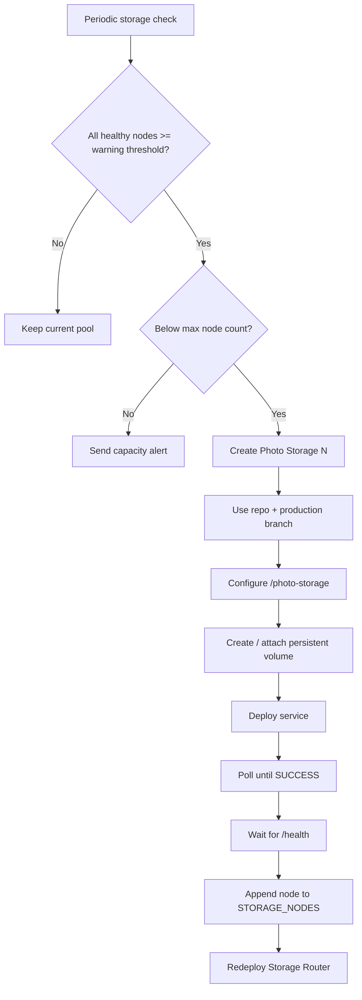
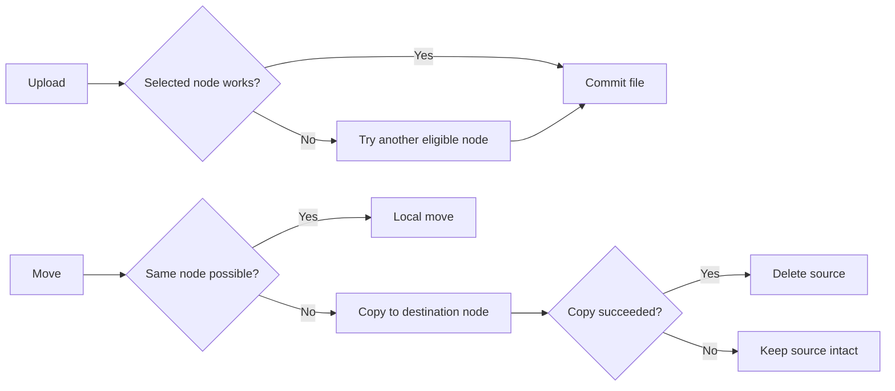

# Immich Railway Multi-Volume Fork

<p align="center">
  <a href="https://github.com/bowardzhang/immich/actions/workflows/storage-router-test.yml"></a>
  <a href="https://github.com/bowardzhang/immich/tree/3.1.0-remote"></a>
  <a href="https://github.com/immich-app/immich/releases/tag/v3.1.0"></a>
  <a href="https://github.com/bowardzhang/immich/commits/3.1.0-remote"></a>
  <a href="https://opensource.org/license/agpl-v3"></a>
</p>

<p align="center">
  
</p>

<p align="center"><strong>Immich adapted for Railway with HTTP-backed multi-volume media storage, automatic expansion, aggregate capacity reporting, health monitoring and storage alerts.</strong></p>

> [!IMPORTANT]
> This repository is a **downstream fork of [immich-app/immich](https://github.com/immich-app/immich)**. The upstream project provides the photo/video management application; this fork focuses on a Railway-oriented storage architecture that can grow beyond a single persistent volume while keeping the Immich client experience largely unchanged.

## What is different in this fork?

The original Immich application expects its media library to be available through filesystem storage. This fork adds an HTTP storage layer that lets original media span multiple Railway persistent volumes behind one logical storage endpoint.

| Area | Upstream Immich | This fork |
|---|---|---|
| Photo/video management | ✅ Full Immich feature set | ✅ Preserved |
| Original-media storage | Local/filesystem-oriented | **HTTP-backed storage pool** |
| Multiple Railway volumes | Manual/custom integration | **Storage Router + Photo Storage nodes** |
| Capacity shown in Immich | Local storage | **Aggregated remote capacity** |
| Node selection | N/A | **Most available healthy node** |
| Upload failover | N/A | **Retry on another eligible node** |
| Storage monitoring | External | **Per-volume health and usage** |
| Capacity alerts | External | **Resend email alerts** |
| Expansion | Manual | **Automatic `Photo Storage N` provisioning** |
| Maximum configured pool | Depends on deployment | **Up to 10 nodes by default** |

## Architecture



The key design rule is that **original photos and videos are routed through Storage Router**, while Immich's own `/data` volume remains in place for application-managed and derived data. Do not delete `/data` after migrating original media.

## How a file is stored



Existing files remain discoverable without a separate routing database: the router probes configured nodes for the logical path and routes subsequent operations to the node that owns the file.

## Automatic expansion

When all configured volumes are healthy and above the warning threshold, the router can provision the next storage node automatically.



Current defaults:

- Warning threshold: `85%`
- Critical threshold: `95%`
- Maximum storage nodes: `10`
- Production branch fallback: `3.1.0-remote`
- Storage service root: `/photo-storage`
- Volume mount: `/photos_extern`

The provisioner explicitly supplies the repository, environment and branch when creating a new `Photo Storage N`, then waits for deployment success and health before adding it to the active pool.

## Main components added or changed

```text
immich/
├── server/                       # Immich server changes for remote media access
├── storage-router/
│   ├── server.mjs               # routing, capacity, file API, alerts
│   ├── bootstrap.mjs            # startup monitoring / provisioning bootstrap
│   ├── provisioner.mjs          # Railway automatic expansion
│   ├── selftest.mjs             # production-safe lifecycle checks
│   └── README.md                # detailed Router reference
├── photo-storage/
│   ├── server.mjs               # one-volume HTTP storage service
│   └── Dockerfile
├── .github/workflows/
│   └── storage-router-test.yml  # multi-volume regression CI
└── RAILWAY_REMOTE_STORAGE.md    # deployment / upgrade notes
```

## Configuration overview

### Immich Server

| Variable | Purpose |
|---|---|
| `IMMICH_MEDIA_LOCATION` | Logical media path, typically `/remote/photo-extern` |
| `REMOTE_STORAGE_URL` | Storage Router private-network URL |
| `REMOTE_STORAGE_TOKEN` | Shared authentication token |

### Storage Router

| Variable | Purpose |
|---|---|
| `STORAGE_NODES` | JSON list of Photo Storage private endpoints |
| `REMOTE_STORAGE_TOKEN` | Protects Router and Photo Storage API access |
| `STORAGE_WARNING_PERCENT` | Expansion / warning threshold |
| `STORAGE_CRITICAL_PERCENT` | Critical alert threshold |
| `STORAGE_AUTO_PROVISION` | Enable/disable automatic expansion |
| `RAILWAY_PROJECT_TOKEN` / `RAILWAY_API_TOKEN` | Railway project access for provisioning |
| `RESEND_API_KEY` | Optional alert delivery |
| `ALERT_EMAIL_TO` | Alert recipient |
| `ALERT_EMAIL_FROM` | Alert sender |

See **[storage-router/README.md](storage-router/README.md)** for the full variable list, endpoint reference and provisioning behavior.

## Storage Router API

```text
GET    /health
GET    /api/storage
GET    /api/storage/status
GET    /api/file?path=...
HEAD   /api/file?path=...
PUT    /api/file?path=...
DELETE /api/file?path=...
MOVE   /api/file?path=...&source=...
GET    /api/list?path=...&recursive=true|false
```

`/api/storage` returns aggregate pool capacity so Immich web/mobile clients can show the total capacity of all configured Photo Storage volumes rather than only the local `/data` filesystem.

## Reliability and safety



The implementation also uses a free-space safety margin, real filesystem capacity from `statfs`, temporary upload staging under ephemeral `/tmp`, health checks, deployment polling, and cleanup of self-test files.

> [!WARNING]
> This storage design is **not a backup strategy**. Keep independent backups of important photos and videos and follow a 3-2-1 backup model.

## Upstream Immich

Immich is a high-performance, self-hosted photo and video management platform with mobile backup, albums, search, facial recognition, maps, sharing, RAW support and many other features.

This fork intentionally does not duplicate the upstream documentation. For standard Immich installation, user features, mobile clients and general administration, use the official resources:

- [Immich documentation](https://docs.immich.app/)
- [Immich project](https://github.com/immich-app/immich)
- [Immich releases](https://github.com/immich-app/immich/releases)

## Upgrade strategy

This repository tracks **stable upstream releases**, rather than deploying directly from upstream `main`.


The current production baseline is `Immich v3.1.0` on branch `3.1.0-remote`. Detailed upgrade and operational notes are in **[RAILWAY_REMOTE_STORAGE.md](RAILWAY_REMOTE_STORAGE.md)**.

## Future work

Planned directions for the fork include:

- End-to-end validation of the next automatically provisioned storage node.
- Stronger repair/recovery logic for partially created Railway services.
- More explicit observability for routing decisions, node health and provisioning history.
- Optional use of the Immich administrator email as the alert recipient once sender-domain configuration allows it.
- Continued compatibility work as new upstream Immich stable releases change storage and media-processing internals.
- Broader automated regression coverage for upload, download, move, delete, transcoding and metadata workflows across multiple volumes.

## Documentation

- **[Railway remote-storage architecture and upgrade notes](RAILWAY_REMOTE_STORAGE.md)**
- **[Storage Router detailed reference](storage-router/README.md)**
- **[Upstream Immich documentation](https://docs.immich.app/)**

## License and attribution

This repository remains licensed under the upstream project's **GNU Affero General Public License v3.0 (AGPL-3.0)**. The majority of the application is derived from the excellent [Immich](https://github.com/immich-app/immich) project; the Railway multi-volume storage architecture and related integration code are downstream modifications maintained in this fork.
