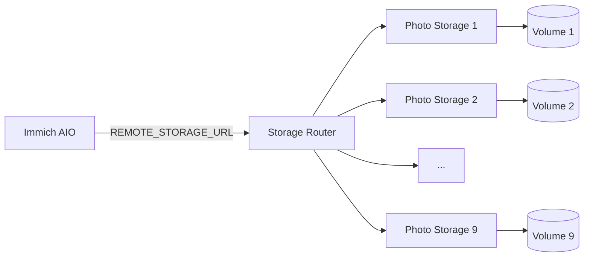

<p align="center"><a href="README.md">简体中文</a> · <strong>English</strong></p>

# Immich Storage Router

Storage Router is the multi-volume media layer used by this fork. Production no longer creates new `Photo Storage N` services automatically. It now uses a **fixed node pool** consisting of Photo Storage services that already exist in Railway and are explicitly listed in `STORAGE_NODES`.

## Current production architecture



As of 2026-09-08, production uses **Photo Storage 1–9**. Storage Router and all Photo Storage nodes run in Railway Serverless mode. Immich AIO remains always-on because PostgreSQL, Redis, and Immich run in the same container.

## Design properties

| Property | Current behavior |
|---|---|
| Routing metadata | No separate routing database |
| New-file placement | Healthy node with the most free space |
| Existing-file lookup | Probe the fixed node pool by logical path |
| Upload failure | Temporary spool and failover to another node |
| MOVE | Prefer local move; cross-node move copies before deleting source |
| Capacity | Aggregate real filesystem capacity from all nodes |
| Expansion | **Manual only**; create a node and update `STORAGE_NODES` |
| Serverless | Router and Photo Storage sleep when idle and wake on requests |

## `STORAGE_NODES`

The active pool is defined entirely by `STORAGE_NODES`.

```json
[
  {"name":"photo-storage-1","url":"http://photo-storage-1.railway.internal:8080"},
  {"name":"photo-storage-2","url":"http://photo-storage-2.railway.internal:8080"},
  {"name":"photo-storage-9","url":"http://photo-storage-9.railway.internal:8080"}
]
```

`REMOTE_STORAGE_TOKEN` protects Router and Photo Storage access. Production currently uses one shared token across the pool.

## Writes and failover

New files are allocated only to healthy nodes with enough free space. The router reserves a default 64 MiB safety margin:

```text
STORAGE_ALLOCATION_SAFETY_BYTES=67108864
```

During upload the Router simultaneously streams to the selected node and spools the request body to ephemeral `/tmp`. The spool is replayed only if the primary node fails, and it is cleaned up on success or failure. The normal success path does not require a second full media copy.

## Reads and deletes

Existing files are located by probing the configured node pool using their logical path. No standalone route-index database is required.

```text
GET/HEAD/DELETE /api/file?path=...
```

## Aggregate capacity

`GET /api/storage` returns the combined capacity of all configured nodes. Immich uses this aggregate result so the web/mobile UI shows the logical remote pool size rather than the small local `/data` volume.

## Serverless mode

Production Router starts with:

```text
node serverless-bootstrap.mjs
```

The serverless bootstrap disables background monitor and self-test timers so that the Router only talks to Photo Storage while serving real requests. This prevents background polling from repeatedly waking sleeping storage nodes.

Photo Storage 1–9 are also configured with `sleepApplication=true`.

## Manual expansion

The automatic Railway provisioner has been removed from the repository. To add capacity manually:

1. Create a new `Photo Storage N` Railway service.
2. Point its source to `bowardzhang/immich` and the production `*-remote` branch.
3. Use `/photo-storage` as the root directory.
4. Mount one persistent volume at `/photos_extern`.
5. Set `REMOTE_STORAGE_TOKEN`.
6. Wait for deployment `SUCCESS` and verify `/health`.
7. Add the node URL to Router `STORAGE_NODES`.
8. Redeploy Router.
9. Verify aggregate capacity and upload/read behavior.

Do not re-enable the old `STORAGE_AUTO_PROVISION`, `STORAGE_PROVISION_*`, or Railway API-token provisioning path. Those variables may still appear in old Railway configuration history, but production code no longer depends on them.

## Endpoints

| Method | Endpoint | Purpose |
|---|---|---|
| `GET` | `/health` | Router health |
| `GET` | `/api/storage` | Aggregate capacity |
| `GET` | `/api/storage/status` | Per-node health and usage |
| `GET` / `HEAD` | `/api/file?path=...` | Read or inspect a file |
| `PUT` | `/api/file?path=...` | Upload a file |
| `DELETE` | `/api/file?path=...` | Delete a file |
| `MOVE` | `/api/file?path=...&source=...` | Move/rename |
| `GET` | `/api/list?path=...&recursive=true\|false` | List files |

## Test utilities kept in the repository

These files are intentionally retained because they are reusable regression/manual tests, not production background tasks:

- `selftest.mjs`
- `test-multi-volume.mjs`
- `test-storage.ps1`

They are not executed automatically by the production Serverless entry point.

## Retired historical components

After the fixed nine-node pool became stable, these files were removed:

- `bootstrap.mjs` — auto-expansion polling entry point
- `provisioner.mjs` — Railway Photo Storage service/volume provisioner
- `maintenance-bootstrap.mjs` — one-shot volume maintenance entry point

Removing them prevents accidental future creation of services or volumes.

## Railway Watch Paths

Production Router watches only:

```text
/storage-router/server.mjs
/storage-router/serverless-bootstrap.mjs
/storage-router/package.json
/storage-router/Dockerfile
```

Documentation and test changes therefore do not restart the Router.

## Media-processing compatibility

FFmpeg, Sharp, ExifTool, and similar tools sometimes require a real local file path. When an original file is no longer under local `/data`, this fork can stage it temporarily from Storage Router into ephemeral local storage, process it, and remove the temporary file afterwards. This is used for thumbnails/previews and related media jobs without copying the entire remote library back into Immich `/data`.

## `/data` operational rule

The Immich AIO `/data` volume still contains PostgreSQL, Redis, thumbnails, previews, encoded video, profiles, and other application data. Do not delete the `/data` volume just because original media is stored remotely.

## Related documentation

- [Railway production architecture and operations](../RAILWAY_REMOTE_STORAGE.en.md)
- [Immich AIO](../all-in-one/README.en.md)
- [Official Immich documentation](https://docs.immich.app/)
