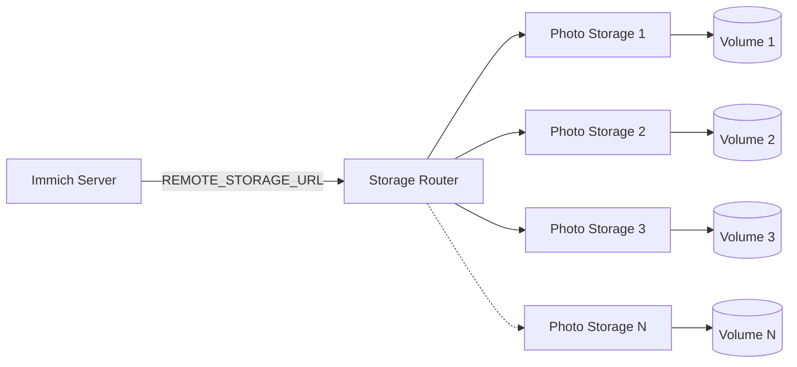
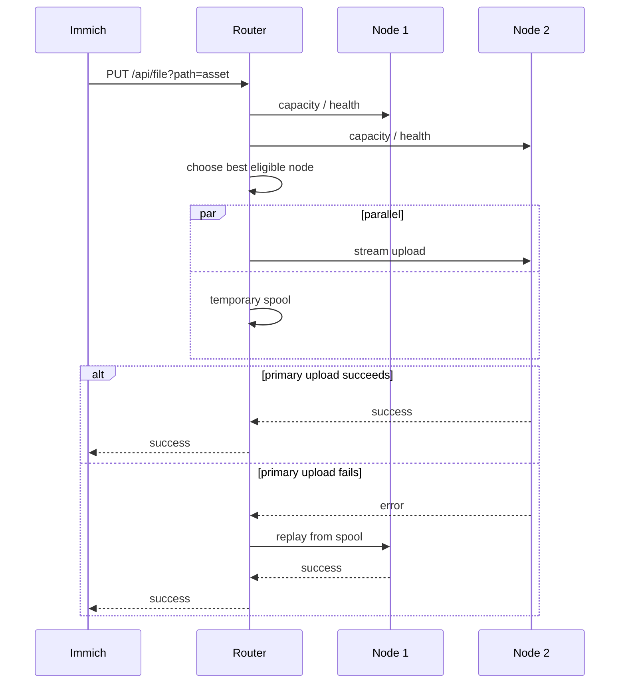
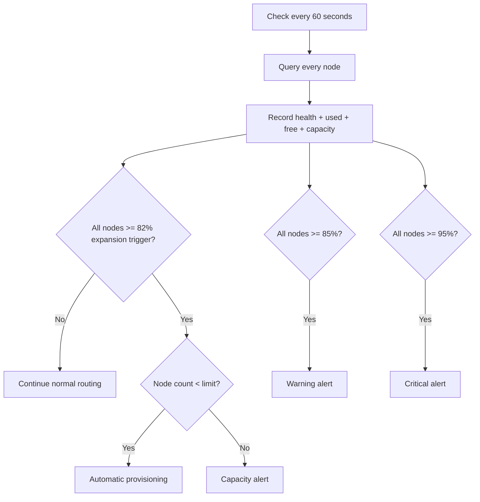
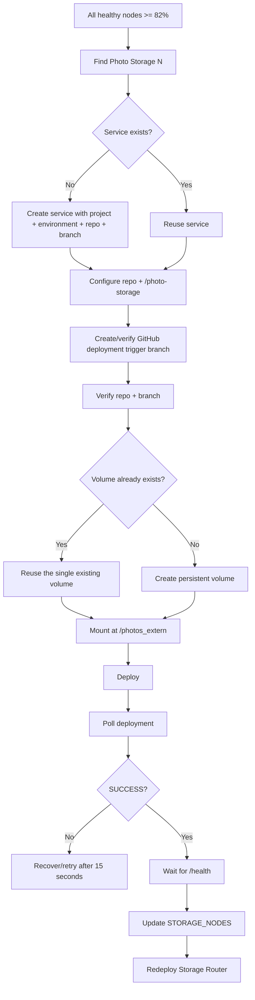
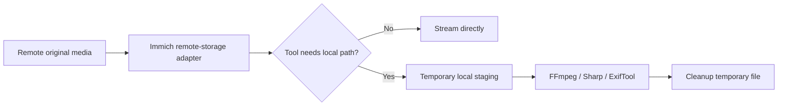

<p align="center"><a href="README.md">简体中文</a> · <strong>English</strong></p>

# Immich Storage Router

[](https://github.com/bowardzhang/immich/actions/workflows/storage-router-test.yml)
[](https://github.com/bowardzhang/immich/tree/3.1.0-remote)
[](https://opensource.org/license/agpl-v3)

Storage Router is the core fork-specific service in this repository. It presents multiple one-volume Photo Storage services to Immich as one logical HTTP-backed media pool.

## Architecture



Immich stores stable logical media paths. Storage Router decides which physical volume contains a file and exposes aggregate capacity back to Immich.

## Design properties

| Property | Behavior |
|---|---|
| Stateless routing metadata | No separate routing database |
| New-file placement | Healthy node with the most available space |
| Existing-file lookup | Probe configured nodes by logical path |
| Upload failure | Retry another eligible node |
| Same-node move | Local move where possible |
| Cross-node move | Copy first, delete source only after success |
| Capacity source | Real filesystem `statfs` values |
| Expansion | Automatic Railway `Photo Storage N` provisioning |
| Alerts | Resend warning / critical email |
| Default node limit | 10 |

## Request flow



The normal path sends media from Router to Photo Storage only once. The temporary spool is written in parallel and is replayed only for failover. If the client aborts the upload, Router tears down the active branches and cleans the temporary spool.

## `STORAGE_NODES`

Example:

```json
[
  {"name":"photo-storage-1","url":"http://photo-storage-1.railway.internal:8080"},
  {"name":"photo-storage-2","url":"http://photo-storage-2.railway.internal:8080"},
  {"name":"photo-storage-3","url":"http://photo-storage-3.railway.internal:8080"}
]
```

`REMOTE_STORAGE_TOKEN` protects Router access and is propagated to automatically created Photo Storage services. A node may optionally define its own token in `STORAGE_NODES`.

## Write routing

New files are considered only for healthy nodes with enough free space for the request plus the configured safety margin. When `Content-Length` is available, it is used before allocation.

Default allocation safety margin:

```text
STORAGE_ALLOCATION_SAFETY_BYTES=67108864
```

That is 64 MiB reserved to reduce race conditions near a full volume.

## Capacity monitoring

The router collects capacity and health from every configured node once per minute. Automatic expansion is deliberately **proactive**: provisioning starts when all healthy volumes reach the expansion trigger (82% by default), leaving headroom for Railway to create, configure, deploy and health-check the next node before the normal 85% warning level is reached.



Production defaults:

```text
STORAGE_PROVISION_TRIGGER_PERCENT=82
STORAGE_WARNING_PERCENT=85
STORAGE_CRITICAL_PERCENT=95
STORAGE_CHECK_INTERVAL_MS=60000
STORAGE_PROVISION_CHECK_INTERVAL_MS=60000
STORAGE_PROVISION_RETRY_INTERVAL_MS=15000
STORAGE_ALLOCATION_SAFETY_BYTES=67108864
```

If provisioning fails after the expansion trigger has been reached, the controller retries after 15 seconds instead of waiting for the normal polling cycle. Normal polling continues every 60 seconds.

Immich's storage endpoint uses Router aggregate capacity, allowing mobile/web clients to display the logical pool size instead of only Immich's local `/data` filesystem.

## Automatic Railway expansion

When every configured volume is healthy and above the proactive expansion trigger, `bootstrap.mjs` provisions the next `Photo Storage N`. The warning threshold remains 85%; the lower expansion trigger exists only to provide build/deployment headroom.



Key safeguards:

- New nodes explicitly use `bowardzhang/immich` and production branch `3.1.0-remote`.
- Creation and recovery verify the GitHub deployment trigger repository and branch.
- If the service already has one volume, recovery reuses it instead of accidentally creating a second volume.
- A node joins the active pool only after deployment is `SUCCESS` and `/health` succeeds.
- A `checkRunning` guard prevents the regular check and fast retry paths from starting two provisioning flows concurrently.

Defaults are:

```text
STORAGE_REPO=bowardzhang/immich
STORAGE_REPO_BRANCH=3.1.0-remote
STORAGE_PROVISION_ROOT_DIRECTORY=/photo-storage
STORAGE_PROVISION_MOUNT_PATH=/photos_extern
STORAGE_MAX_VOLUMES=10
```

Required runtime context:

```text
RAILWAY_PROJECT_ID
RAILWAY_ENVIRONMENT_ID
RAILWAY_SERVICE_ID
REMOTE_STORAGE_TOKEN
RAILWAY_PROJECT_TOKEN or RAILWAY_API_TOKEN
```

Preferred authentication is a Railway Project Token in `RAILWAY_PROJECT_TOKEN`. For backward compatibility, `RAILWAY_API_TOKEN` is also accepted; if Bearer authentication is rejected, the code retries it as a Project Token using `Project-Access-Token`.

Optional controls:

```text
STORAGE_AUTO_PROVISION=false
STORAGE_PROVISION_TRIGGER_PERCENT=82
STORAGE_PROVISION_CHECK_INTERVAL_MS=60000
STORAGE_PROVISION_RETRY_INTERVAL_MS=15000
STORAGE_PROVISION_COOLDOWN_MS=3600000
STORAGE_PROVISION_DEPLOY_TIMEOUT_MS=300000
STORAGE_PROVISION_HEALTH_TIMEOUT_MS=120000
```

On startup, the provisioner performs an access check and logs `storage-provision-access` with `PASS` or `FAIL` without printing token values.

## Alerts

Capacity warnings and critical conditions can be delivered through Resend.

```text
RESEND_API_KEY
ALERT_EMAIL_TO
ALERT_EMAIL_FROM
```

At the configured maximum node count, the system alerts instead of attempting to create an unsupported extra storage node.

## Endpoints

| Method | Endpoint | Purpose |
|---|---|---|
| `GET` | `/health` | Router health |
| `GET` | `/api/storage` | Aggregate pool capacity |
| `GET` | `/api/storage/status` | Per-volume health and usage |
| `GET` / `HEAD` | `/api/file?path=...` | Read or inspect a file |
| `PUT` | `/api/file?path=...` | Upload a file |
| `DELETE` | `/api/file?path=...` | Delete a file |
| `MOVE` | `/api/file?path=...&source=...` | Move/rename a file |
| `GET` | `/api/list?path=...&recursive=true\|false` | List files |

## Temporary files and self-tests

Production self-tests write under `.storage-router-selftest/`, verify the file lifecycle and delete test files during normal and best-effort failure cleanup. Upload staging uses ephemeral `/tmp`, not persistent Photo Storage volumes.

Repository regression tests such as `test-multi-volume.mjs` use in-memory mock volumes and cover normal streaming uploads, chunked bodies without `Content-Length`, spool failover after primary-node failure, and cleanup/recovery after client-aborted uploads. Test-only scripts are not copied into the production Router image.

## Media-processing compatibility

Immich components such as FFmpeg, Sharp and ExifTool sometimes require real filesystem paths. This fork combines HTTP streaming with local ephemeral staging where such tools need a local file.



## Operational rule for `/data`

Do not delete Immich-managed `thumbs`, `encoded-video`, `profile`, `backups` or similar `/data` content merely because original photos and videos are remote. `/data` remains part of the Immich application architecture.

## Railway Watch Paths

Production Router watches only the core files that affect its runtime image, for example:

```text
/storage-router/server.mjs
/storage-router/bootstrap.mjs
/storage-router/provisioner.mjs
/storage-router/selftest.mjs
/storage-router/package.json
/storage-router/Dockerfile
```

Changing `storage-router/README.md`, its English counterpart, or test-only files therefore does not restart the production Router.

## Upgrading Immich

This fork tracks upstream stable versions using versioned `*-remote` branches.


Do not blindly deploy upstream `main`. Verify database migrations, upload/read/delete/move, thumbnails, video processing, metadata extraction, aggregate capacity and multi-volume routing before switching production.

## Related documentation

- [中文版本（默认）](README.md)
- [Fork overview — English](../README.en.md)
- [Railway deployment, operations, and upgrades — English](../RAILWAY_REMOTE_STORAGE.en.md)
- [Official Immich documentation](https://docs.immich.app/) — upstream application documentation
