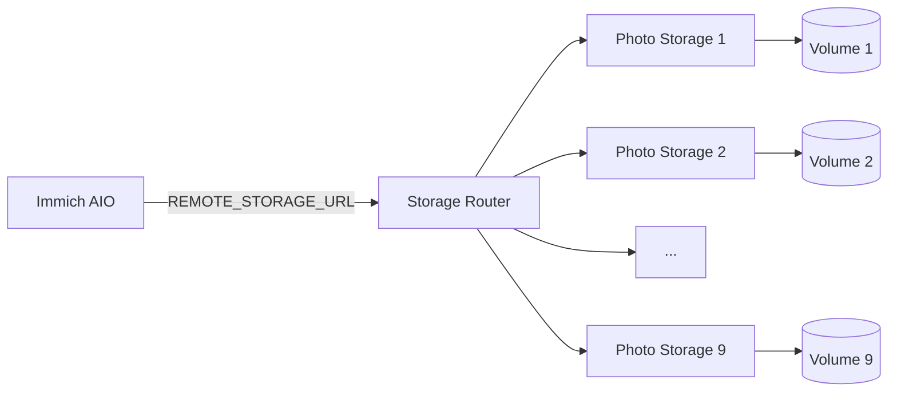

# Immich Storage Router 中文文档

<p align="center"><strong>简体中文</strong> · <a href="README.en.md">English</a></p>

Storage Router 是本 Fork 的多卷媒体存储层。当前生产环境不再自动创建新的 `Photo Storage N`；它使用一个**固定节点池**，由 Railway 中已经存在并手工配置好的 Photo Storage 服务组成。

## 当前生产架构



截至 2026-09-08，生产环境固定使用 **Photo Storage 1–9**。Storage Router 和所有 Photo Storage 节点均启用 Railway Serverless；Immich AIO 保持常驻，因为其中同时运行 PostgreSQL、Redis 和 Immich。

## 设计原则

| 项目 | 当前行为 |
|---|---|
| 路由元数据 | 无单独路由数据库 |
| 新文件分配 | 选择剩余空间最多的健康节点 |
| 已有文件定位 | 按逻辑路径查询固定节点池 |
| 上传失败 | 使用临时 spool 向其他节点 failover |
| MOVE | 同节点优先本地移动，跨节点先复制成功再删源 |
| 容量 | 汇总各节点真实文件系统容量 |
| 扩容 | **不自动创建服务**；需要时手工新增节点并更新 `STORAGE_NODES` |
| Serverless | Router 和 Photo Storage 均可睡眠，按请求唤醒 |

## `STORAGE_NODES`

Router 的活动节点完全由 `STORAGE_NODES` 决定。示例：

```json
[
  {"name":"photo-storage-1","url":"http://photo-storage-1.railway.internal:8080"},
  {"name":"photo-storage-2","url":"http://photo-storage-2.railway.internal:8080"},
  {"name":"photo-storage-9","url":"http://photo-storage-9.railway.internal:8080"}
]
```

`REMOTE_STORAGE_TOKEN` 用于保护 Router 和 Photo Storage API。当前生产节点使用同一个共享 token。

## 写入与故障转移

新文件只分配到健康且有足够剩余空间的节点。Router 默认额外保留 64 MiB 安全余量：

```text
STORAGE_ALLOCATION_SAFETY_BYTES=67108864
```

上传时 Router 同时：

1. 向选定节点流式写入；
2. 将请求体临时 spool 到 ephemeral `/tmp`；
3. 主节点失败时，从 spool 重放到其他可用节点；
4. 成功或失败后清理临时文件。

正常成功路径不会额外复制一遍完整文件。

## 读取和删除

已有文件通过逻辑路径在固定节点池中定位：

```text
GET/HEAD/DELETE /api/file?path=...
```

Router 找到拥有该文件的节点后再执行实际操作。该设计不依赖独立索引数据库，所以迁移节点或恢复服务时不会产生额外路由元数据一致性问题。

## 聚合容量

`GET /api/storage` 返回所有配置节点的聚合容量。Immich 的 storage API 使用这个值，因此 Web 页面显示的是整个远程媒体池容量，而不是本地 `/data` 单卷容量。

## Serverless 模式

生产 Router 启动命令：

```text
node serverless-bootstrap.mjs
```

`serverless-bootstrap.mjs` 会禁用 Router 的后台定时 monitor 和自测 timer，使 Router 只在真实 API 请求期间访问 Photo Storage。这样：

- Router 可以在空闲时睡眠；
- Photo Storage 不会被 Router 自己的定时请求反复唤醒；
- 用户访问 Immich 时，Railway 会自动唤醒需要的节点。

生产 Photo Storage 1–9 也全部设置为 `sleepApplication=true`。

## 手工扩容

自动 provisioner 已从仓库删除。需要增加节点时，采用手工流程：

1. 在 Railway 创建新的 `Photo Storage N` 服务；
2. Source 指向 `bowardzhang/immich` 的生产 `*-remote` 分支；
3. Root Directory 使用 `/photo-storage`；
4. 挂载一个 Persistent Volume 到 `/photos_extern`；
5. 设置 `REMOTE_STORAGE_TOKEN`；
6. 等待部署 `SUCCESS`，确认 `/health` 正常；
7. 将节点 URL 加入 Router 的 `STORAGE_NODES`；
8. 重新部署 Router；
9. 验证 `/api/storage` 聚合容量和上传/读取。

不要重新启用旧的 `STORAGE_AUTO_PROVISION`、`STORAGE_PROVISION_*` 或 Railway API token provisioning 机制；这些变量现在只是历史部署残留，生产代码不再依赖它们。

## API

| 方法 | Endpoint | 用途 |
|---|---|---|
| `GET` | `/health` | Router 健康检查 |
| `GET` | `/api/storage` | 聚合容量 |
| `GET` | `/api/storage/status` | 节点健康与使用率 |
| `GET` / `HEAD` | `/api/file?path=...` | 读取/检查文件 |
| `PUT` | `/api/file?path=...` | 上传文件 |
| `DELETE` | `/api/file?path=...` | 删除文件 |
| `MOVE` | `/api/file?path=...&source=...` | 移动/重命名 |
| `GET` | `/api/list?path=...&recursive=true\|false` | 列出文件 |

## 测试脚本

以下脚本保留在仓库中，因为它们是可重复的回归测试，而不是生产后台任务：

- `selftest.mjs`
- `test-multi-volume.mjs`
- `test-storage.ps1`

生产 Serverless 启动不会自动执行这些测试。

## 已移除的历史组件

以下组件已在固定 9 节点架构稳定后删除：

- `bootstrap.mjs` — 自动扩容轮询入口
- `provisioner.mjs` — Railway 自动创建/恢复 Photo Storage 服务
- `maintenance-bootstrap.mjs` — 一次性 Volume 清理入口

这样可以避免未来误触发自动创建服务或 Volume。

## Railway Watch Paths

生产 Router 只监视：

```text
/storage-router/server.mjs
/storage-router/serverless-bootstrap.mjs
/storage-router/package.json
/storage-router/Dockerfile
```

文档和测试文件改动不会导致生产 Router 重启。

## 媒体处理兼容性

FFmpeg、Sharp、ExifTool 等工具有时要求真实本地路径。本 Fork 在本地文件不存在时，可通过 Storage Router 临时取回远端原图到 ephemeral 文件，处理完成后清理。该机制用于缩略图、预览和其他媒体处理，不会把整个远程媒体库重新复制回 Immich `/data`。

## `/data` 运维规则

Immich AIO 的 `/data` 仍包含 PostgreSQL、Redis、缩略图、预览、转码视频、用户资料和其他应用数据。即使原始照片/视频已经在远程 Photo Storage，也不能手工删除 `/data` Volume。

## 相关文档

- [`../RAILWAY_REMOTE_STORAGE.md`](../RAILWAY_REMOTE_STORAGE.md) — Railway 当前生产部署与运维
- [`../all-in-one/README.md`](../all-in-one/README.md) — Immich AIO 架构
- [Immich 官方文档](https://docs.immich.app/)
