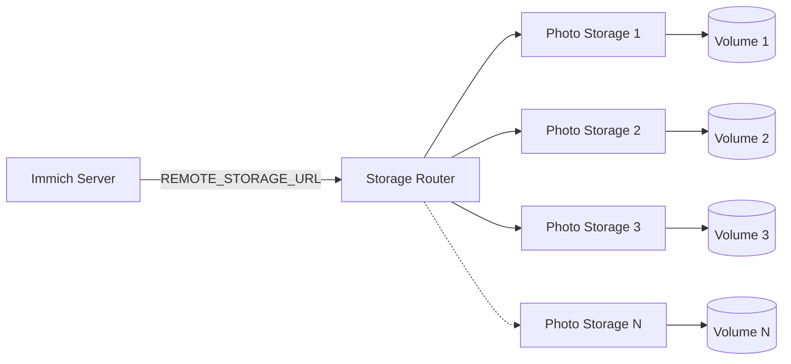
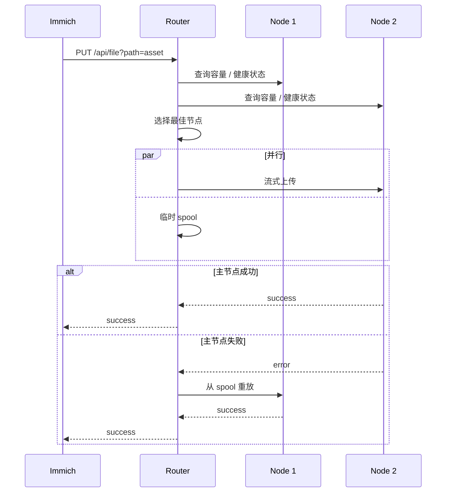
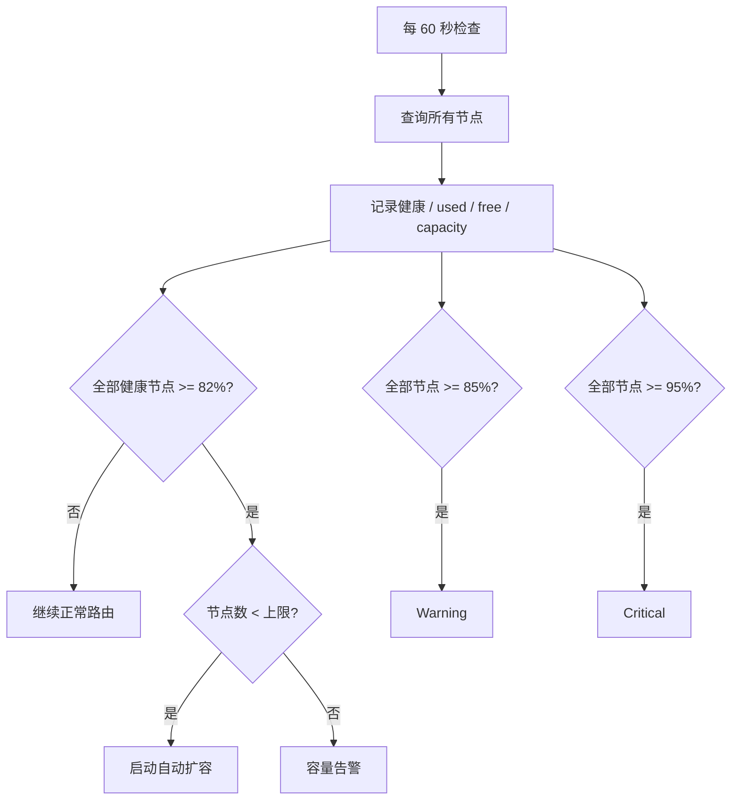
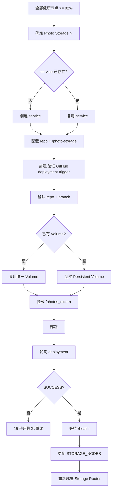
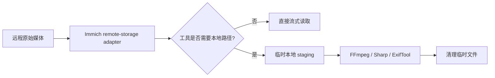

# Immich Storage Router 中文文档

<p align="center"><strong>简体中文</strong> · <a href="README.en.md">English</a></p>

Storage Router 是本 Fork 最核心的定制服务：它把多个各自挂载一个 Railway Persistent Volume 的 `Photo Storage N` 服务组合成一个逻辑 HTTP 媒体存储池，供 Immich Server 使用。

## 架构



Immich 保存稳定的逻辑媒体路径；Storage Router 决定文件实际位于哪个 Volume，并向 Immich 返回整个存储池的聚合容量。

## 设计特性

| 特性 | 行为 |
|---|---|
| 路由元数据 | 无单独路由数据库 |
| 新文件分配 | 选择剩余空间最多的健康节点 |
| 已有文件定位 | 按逻辑路径查询已配置节点 |
| 上传失败 | 使用临时 spool 向其他可用节点 failover |
| 同节点 MOVE | 尽量本地移动 |
| 跨节点 MOVE | 先复制成功，再删除源文件 |
| 容量来源 | 真实文件系统 `statfs` |
| 扩容 | Railway 自动创建 `Photo Storage N` |
| 告警 | Resend Warning / Critical 邮件 |
| 默认节点上限 | 10 |

## 上传请求流程



正常路径只有一次 Router→Photo Storage 数据传输；spool 与主上传并行进行，只在主节点失败时用于重放。客户端主动中止上传时，Router 会销毁正在进行的分支并清理临时目录。

## `STORAGE_NODES`

示例：

```json
[
  {"name":"photo-storage-1","url":"http://photo-storage-1.railway.internal:8080"},
  {"name":"photo-storage-2","url":"http://photo-storage-2.railway.internal:8080"},
  {"name":"photo-storage-3","url":"http://photo-storage-3.railway.internal:8080"}
]
```

`REMOTE_STORAGE_TOKEN` 用于保护 Router API，并传递给自动创建的 Photo Storage 服务。必要时节点也可以在 `STORAGE_NODES` 中配置独立 token。

## 写入路由

新文件只会分配到健康且有足够剩余空间的节点。Router 会额外保留安全余量：

```text
STORAGE_ALLOCATION_SAFETY_BYTES=67108864
```

即默认保留 **64 MiB**，降低多个并发写入在接近满盘时发生空间竞争的风险。

## 容量监控

Router 每分钟读取全部已配置节点的真实容量和健康状态。自动扩容采用**提前触发**：所有健康 Volume 达到 **82%** 时就开始扩容，为 Railway 创建 service、配置、build、deployment 和 healthcheck 留出空间；正常 Warning 仍为 **85%**，Critical 为 **95%**。



当前生产默认配置：

```text
STORAGE_PROVISION_TRIGGER_PERCENT=82
STORAGE_WARNING_PERCENT=85
STORAGE_CRITICAL_PERCENT=95
STORAGE_CHECK_INTERVAL_MS=60000
STORAGE_PROVISION_CHECK_INTERVAL_MS=60000
STORAGE_PROVISION_RETRY_INTERVAL_MS=15000
STORAGE_ALLOCATION_SAFETY_BYTES=67108864
```

如果达到扩容线后 provisioning 失败，控制器 **15 秒后重试**，而不是等下一轮正常轮询。正常检查仍每 60 秒执行。

## Railway 自动扩容

`bootstrap.mjs` 负责周期性判断容量并调用 `provisioner.mjs` 创建下一 `Photo Storage N`。



关键防护：

- 新节点显式使用 `bowardzhang/immich` 和生产分支 `3.1.0-remote`。
- 创建或恢复节点后会验证 GitHub deployment trigger 的 repo/branch。
- 如果 service 已经有一个 Volume，恢复流程会复用它，不会错误地再创建第二个 Volume。
- 节点只有在 deployment=`SUCCESS` 且 `/health` 正常后才加入活动池。
- `checkRunning` 防止定时检查和快速 retry 同时启动两个 provisioning 流程。

默认值：

```text
STORAGE_REPO=bowardzhang/immich
STORAGE_REPO_BRANCH=3.1.0-remote
STORAGE_PROVISION_ROOT_DIRECTORY=/photo-storage
STORAGE_PROVISION_MOUNT_PATH=/photos_extern
STORAGE_MAX_VOLUMES=10
```

运行时需要：

```text
RAILWAY_PROJECT_ID
RAILWAY_ENVIRONMENT_ID
RAILWAY_SERVICE_ID
REMOTE_STORAGE_TOKEN
RAILWAY_PROJECT_TOKEN 或 RAILWAY_API_TOKEN
```

推荐使用 Railway Project Token。代码优先读取 `RAILWAY_PROJECT_TOKEN`；为兼容现有部署，也支持 `RAILWAY_API_TOKEN`，必要时会以 `Project-Access-Token` 方式重试。

可选控制项：

```text
STORAGE_AUTO_PROVISION=false
STORAGE_PROVISION_TRIGGER_PERCENT=82
STORAGE_PROVISION_CHECK_INTERVAL_MS=60000
STORAGE_PROVISION_RETRY_INTERVAL_MS=15000
STORAGE_PROVISION_COOLDOWN_MS=3600000
STORAGE_PROVISION_DEPLOY_TIMEOUT_MS=300000
STORAGE_PROVISION_HEALTH_TIMEOUT_MS=120000
```

Router 启动后会执行 provisioning 权限检查，并记录 `storage-provision-access` 的 `PASS` 或 `FAIL`，不会输出 token 内容。

## 容量告警

可通过 Resend 发送 Warning/Critical 邮件：

```text
RESEND_API_KEY
ALERT_EMAIL_TO
ALERT_EMAIL_FROM
```

达到 `STORAGE_MAX_VOLUMES` 后系统只发送告警，不会继续创建超出支持上限的节点。

## API

| 方法 | Endpoint | 用途 |
|---|---|---|
| `GET` | `/health` | Router 健康检查 |
| `GET` | `/api/storage` | 聚合存储池容量 |
| `GET` | `/api/storage/status` | 各 Volume 健康状态和使用率 |
| `GET` / `HEAD` | `/api/file?path=...` | 读取/检查文件 |
| `PUT` | `/api/file?path=...` | 上传文件 |
| `DELETE` | `/api/file?path=...` | 删除文件 |
| `MOVE` | `/api/file?path=...&source=...` | 移动/重命名文件 |
| `GET` | `/api/list?path=...&recursive=true\|false` | 列出文件 |

## 临时文件和 Self-test

生产 self-test 在 `.storage-router-selftest/` 下写入测试文件，验证完整生命周期后删除。上传 spool 使用 ephemeral `/tmp`，不会占用 Photo Storage Persistent Volume。

仓库中的 `test-multi-volume.mjs` 使用内存 mock volume；测试覆盖普通流式上传、无 `Content-Length` 的 chunked body、主节点失败后的 spool failover，以及客户端中止上传后的恢复和清理。

## 媒体处理兼容性

FFmpeg、Sharp、ExifTool 等工具有时要求真实本地文件路径。本 Fork 在这些场景使用临时本地 staging：



## `/data` 运维规则

即使原始照片和视频已经迁移到远程 Photo Storage，也不要手工删除 Immich 管理的 `thumbs`、`encoded-video`、`profile`、`backups` 等 `/data` 内容。`/data` 仍是 Immich 架构的一部分。

## Railway Watch Paths

生产 Router 只监视实际影响运行镜像的核心文件，例如：

```text
/storage-router/server.mjs
/storage-router/bootstrap.mjs
/storage-router/provisioner.mjs
/storage-router/selftest.mjs
/storage-router/package.json
/storage-router/Dockerfile
```

因此修改 `storage-router/README.md` 或测试文件不会重启生产 Router。这一点对手机持续备份期间的稳定性很重要。

## 升级 Immich

本 Fork 用版本化 `*-remote` 分支跟踪上游 stable release：


不要直接把生产环境指向上游 `main`。切换生产前至少验证数据库迁移、上传/读取/删除/MOVE、缩略图、视频处理、元数据提取、聚合容量和多卷路由。

## 相关中文文档

- [`../README.md`](../README.md) — Fork 总览和架构
- [`../RAILWAY_REMOTE_STORAGE.md`](../RAILWAY_REMOTE_STORAGE.md) — Railway 部署、运维和升级
- [Immich 官方文档](https://docs.immich.app/) — 上游标准 Immich 功能
